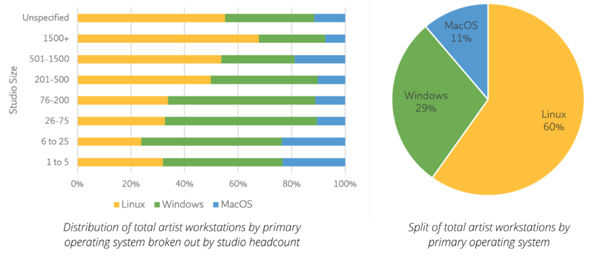
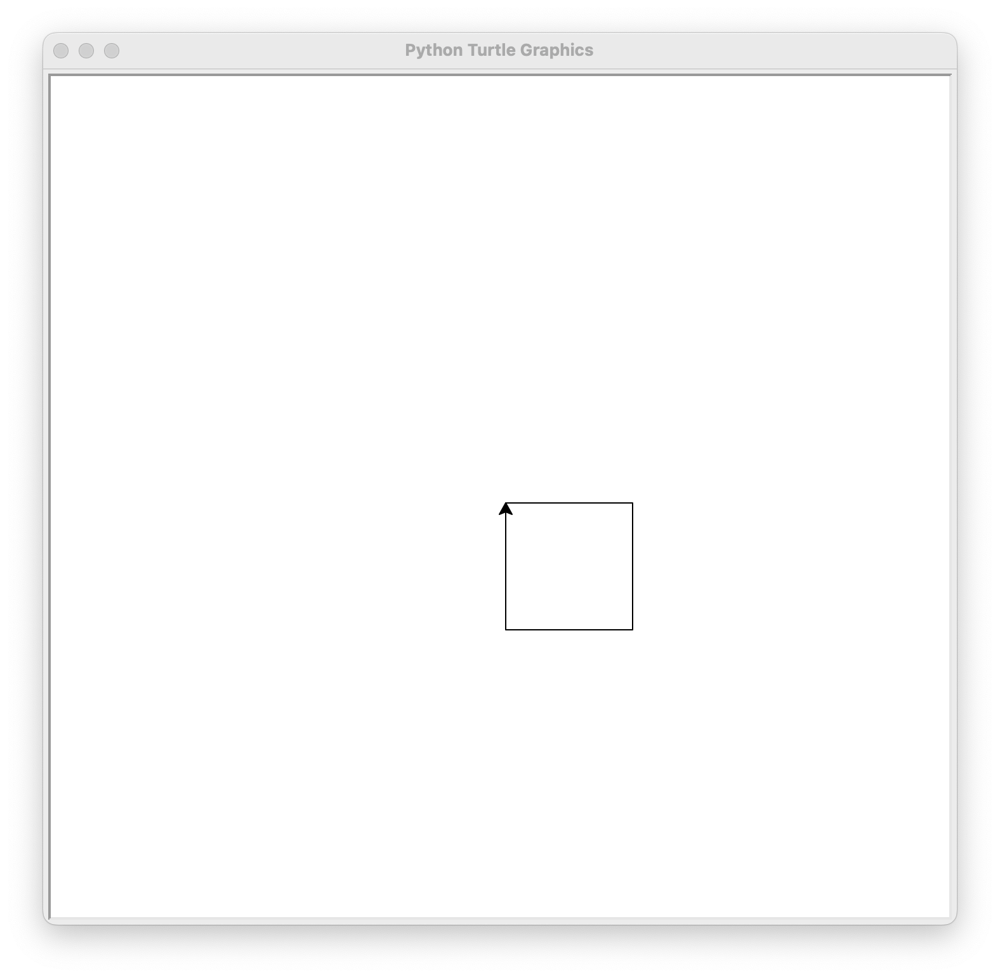

#### Lecture 1
### Introduction to Procedural Content Creation

##### Jon Macey, Ian Stephenson, Oleg Fryazinov 

- **Course:** BA Computer Animation and Visual Effects
- **Level:** 4 
- **Unit:** Procedural Content Creation

---

# Session outline

- **Title:** Introduction to Procedural Content Creation
- **What will you learn today:**
  - What this unit is about and why you are studying it 
  - What is Linux and what is Python

---

# Unit overview

- PCG runs in the first semester
- 12 weeks, 2 sessions each week
- Sessions can be more theoretical (lectures) or practical (workshops)
  - All the sessions in the computer labs, as we have practical elements during each session

--

##  Unit aims
 
- Develop the skill of computational thinking
- Apply it to the production of animation and visual effects.  

Note:
  The notes keyword is used to add speaker notes to a slide. 
  These notes are not visible to the audience.
  Note the new line and the Tabs
  
--

## What will you learn in the unit

- How to create assets using code / scripting
- How to speak with computer using Python language
- Why blending arts and science can be fun
  
--  

## Assignment

- In the end of the semester 
- Scripting project with several options to choose
  - We will discuss it during one of the latter sessions
- 100% mark

---

## What is Procedural Content Creation?

- The unit name is three words: **procedural**, **content** and **creation**
- We are going to **create** assets that can be used for computer animation and visual effects pipeline (**content**) **procedurally**

--

## What is procedural

- What is the difference between **procedural** and **manual**?
  - We are going to write procedure and then computer will create the asset by following the procedure
  - We are going to write **the script** and the computer is going to **run** the script

--

## Context

- You are studying the subject of **computer** animation
  - We are all using computers
  - Your phone and even drawing tablet is a computer

--

## Applications

- **Computer Animation**
  - Rigging
  - Procedural animation (crowds, flocking, etc.)
- **Visual Effects**
  - Simulations: fluid, smoke, shattering, cloth...
  - Procedural Modelling
- **Art**
  - Generative art

--

### Why create content procedurally?

- The ability to write new software gives extra power to go beyond the capabilities of the software
- Efficiency
  - You can create some assets quicker than manually
- Variety
  - Different assets can be created using the same procedure

--

### Programming sounds technical

- "*I think only a mathematically minded people can ever write programs*" - **wrong**.  
- Process of creating art is similar to the process of creating programs
  - Starting software with sketches, tiny programs that just do one thing
  - Refine ideas through trial and error (and abstraction)
- Writing scripts is easier than you think
  - More about that later this session

--

### The creative process of computing
- As you go through the unit, you might encounter some points you might not really understand what is happening
- Do not be shy to ask questions as we are going along
- In these sessions we are going stress important parts that cannot be skipped
- Perfection comes with practice

--

### The creative process of computing


- There is no "right way" or "wrong way" when it comes to programming
  - Similar to art!
  - The only "right direction" in programming is to ensure the program is doing what is supposed to do

--

### Learning to speak with a computer

- Let we try to understand computers
- We are going to use **Linux** operating system. 
  - Have you heard about Linux?
- Most of the Digital Content Creation (DCC) tools were developed under Unix or Linux 
  - Unix is the family of computer operating systems. 
  - If you are using Mac, Macos is Unix
  - Linux is Unix as well

---

## Why Linux


- **Why Linux?**
  - Lots of software work under Linux in the same way as for other operating systems
  - Stable
  - Secure
  - Controllable
  - User-friendly
  - Build for software development

--


## Why Linux

- as you can see it is the most used OS in the VFX industry


<blockquote><small><p>Source: <a href="https://drive.google.com/file/d/15b-4GMTSEE9tyqeQdBfy_LZnxQIdp38Y/view" target="_blank">Studio Platform Survey</a></p></small></blockquote>

--


## Loading Linux

* Restart your machine <!-- .element: class="fragment highlight-red" -->
* Press F12 when you see the banner <!-- .element: class="fragment highlight-red" -->
* In the menu select "Red Hat Boot Manager" <!-- .element: class="fragment highlight-red" -->

---

## Loading Linux

* Use your student username (s123456) and password to log in 
* Locate Terminal in the menu on top 
* or right mouse click and select "open in Terminal" 

--

## Terminal

- The terminal is the most powerful tool you have on your computer. 
- It is the gateway to the operating system. 
- Terminal allows you to do things that are not possible with a GUI
- You speak with the OS using Terminal

---

## Terminal 

- The first thing we need to do is to get a terminal open
- When we open the terminal, it runs a program called a shell and awaits for your command
- Try this command (you need to press Enter after typing it)

```bash
pwd
```
- what do you think this has done?
- What do you think pwd stands for?

--

# The filesystem 

- Most of the work we do is based on a filesystem and navigating 
- The filesystem is a tree structure with a root at the top
- The root is the top level of the filesystem and is represented by a **/** character.
- Under the root are a number of directories 
  - They are called folders in Windows. 
  - They can contain files and other directories

--

## The filesystem : directories
- Each of you have a home directory, in your case it will be ```/home/i[STUDENT_NUMBER]```]
- ~ is a shortcut for your home directory we can use it to mean "from home" 
- To list the contents of a directory we use the ```ls``` command 

```
ls ~
```

- what else is in your home directory?


--

## The filesystem: files

- Each file has a name and and possibly an extension
- There are different file types and we will get to know them.
- For example, .mb files are Maya binaries and can be opened by Maya
- We will come back to files and folder in a later session.

---

## Why Python

- Python is what is know as an interpreted language
- It reads programs line by line executing each instruction
  - We can have our programs run as we type
  - For beginners it makes starting with Python less frustrating!
- **Python in the industry**
  - Scripting in Maya, Houdini, and most pipelines are built from python

--

## Examples of Python in DCC

- I'm now going to show you some practical examples of why we use python.
  - Maya Example
  - Houdini Example (not python but procedural)

--

## Python scripts

- Often we use the term *script*. 
- What is the script in filmmaking?

<blockquote><small><p>A movie script is a written document that details all of the narrative and visual elements for a feature-length or short movie. This document includes very specific formatting, namely action paragraphs, character dialogue, and in some cases, visual and sound cues. </p></small></blockquote>

- Movie script explains what happens in the shot 
- Script in programming explains what happens in the program

---

## Getting started

- The machines you use are all the same, for security purposes they are locked down
- This makes things more complex when programming
- To overcome this we need to install our own local python (another python advantage)
- Full details on how to do this are in [this blog post](https://nccastaff.bournemouth.ac.uk/jmacey/post/PythonInstall/PythonInstall/)

--

## Installing Python

- open a terminal and type the following


```bash
install_python.sh
```

This may take a few minutes to run

---

## ["hello world" in Python](https://en.wikipedia.org/wiki/%22Hello,_World!%22_program)

- In the terminal type the command **python** and press enter
- You will enter the Python environment
  - Python shell
- Start with writing this code:

```python
print("Hello World!")
```
- After you press "Enter" you should see *Hello World* in your shell
- You just wrote your first Python program!

--

## Explanation of the code
```python
print("Hello World")
```
- This code has only one command.
  - It tells the Python shell to **print** the string "Hello World"
  - Brackets are used to indicate the string is *the argument* for the command
  
- Now try to output your own string in the Python shell

---

### Creating graphics with Python

- Now try the following code 
  - Note we have graphics window appearing

```python
import turtle 
turtle.down()
```

- to exit python we can send the command ```exit()``` or press ```Ctrl-D```


--

### Creating graphics with Python

- Now we are going to write a new program, we need to re-open the [REPL](https://en.wikipedia.org/wiki/Read%E2%80%93eval%E2%80%93print_loop) by typing ```python``` again.

```python
import turtle 
turtle.down()
turtle.forward(100)
turtle.right(90)
turtle.forward(100)
turtle.right(90)
turtle.forward(100)
turtle.right(90)
turtle.forward(100)
turtle.right(90)
```

--

## result


--


### Explanation


- ```import``` command imports the *library* turtle
- ```down``` command puts the *pen* down
- ```forward(n)``` command moves the pen a number of pixels forward
- ```right(deg)``` command turns the pen right given by deg degrees
  

--

### Creating graphics with Python 

- The previous code draws a square
- Can you draw other shapes like triangle?

---

# Conclusion

- **What have you learned today**
  - Your (probably) first two hours in Linux
  - Your first script in Python that draws a square
- **Homework**
  - Modify the code to draw a cross (or letter X)

--

# Next time

- **What will you learn next time**
  - Files and directories in Linux
  - Getting out of the Python shell 
    - Working with .py scripts
  - Learning more about *libraries*

--

## Q&A and discussion
- **Open Floor for Questions**

