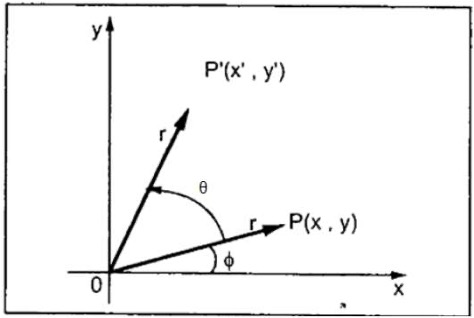

## Lesson 10: Transformations

#### Jon Macey, Ian Stephenson, Oleg Fryazinov 

- **Course:** BA Computer Animation and Visual Effects
- **Level:** 4 
- **Unit:** Procedural Content Creation

---

# Session outline

- **Title:** Transformations
- **What will you learn today:**
  - How to move, rotate and scale objects using the code

---

## Recap: functions

- A **function** is a reusable block of code that performs a specific task.
- Parameters are variables that a function uses as input. When calling a function, arguments are passed to these parameters.

```python
def add_numbers(a, b):
    return a + b

print(add_numbers(3, 5))  # Output: 8
```

---

## Transformation: a definition

- A geometric transformation is a function which maps from a point set to itself or another point set.


--

## Classification of transformations

- From the geometric point of view, we can classify transformations according to the properties they preserve
  - Distances
  - Angles
  - Ratios between distances
  - Parallelism
  


--

## Affine transformations

- Affine transformation is a transformation that preserves 
  - Collinearity (all points lying on a line initially still lie on a line after transformation)
  - Ratios of distances (the midpoint of a line segment remains the midpoint after transformation)


--

## Affine transformations

- Affine transformations include
  - Translation
  - Rotation
  - Scaling
  - Shear
  - The composition of the transformation above


---

## Preparing the playground

[01_drawbox.py](https://github.com/NCCA/PCCSlides/blob/main/Lecture10/code/01_drawbox.py)

```python
#!/usr/bin/env python3
import math

from PIL import Image, ImageDraw

im = Image.new("RGB", (640, 480), (100, 0, 20))
draw = ImageDraw.Draw(im)
white = (255, 255, 255)
points = [(100, 100), (200, 100), (200, 200), (100, 200), (100, 100)]
draw.line(points, white)
im.show()

```

---

## Translation

- Translation is to move, or parallel shift, a point or points


--

## Translation formula

- Translation is defined by adding an offset:
- $x\prime=x+t_x$
- $y\prime=y+t_y$


--

#### Translation: Python implementation

[02_translate_box.py](https://github.com/NCCA/PCCSlides/blob/main/Lecture10/code/02_translate_box.py)

```python
#!/usr/bin/env python3
import math
from random import randint

from PIL import Image, ImageDraw


def translate_points(points, dx, dy) -> list:
    new_points = list()
    for p in points:
        new_points.append((p[0] + dx, p[1] + dy))
    return new_points


im = Image.new("RGB", (640, 480), (100, 0, 20))
draw = ImageDraw.Draw(im)
white = (255, 255, 255)
green = (0, 255, 0)
points = [(100, 100), (200, 100), (200, 200), (100, 200), (100, 100)]
draw.line(tuple(points), white)
new_points = translate_points(points, 50, 50)
draw.line(tuple(new_points), green)
im.show()
```

--

#### Translation: Refining Python implementation

[03_translate_box2.py](https://github.com/NCCA/PCCSlides/blob/main/Lecture10/code/03_translate_box2.py)

```python
#!/usr/bin/env python3
from PIL import Image, ImageDraw

def translate_point(point, dx, dy) -> (float, float):  
    # The function moves just one point given the offset
    return (point[0] + dx, point[1] + dy)


def translate_points(points, dx, dy) -> list:  
    # This function moves multiple points with the same offset
    newPoints = list()
    for p in points:
        newPoints.append(translate_point(p, dx, dy))
    return newPoints


im = Image.new("RGB", (640, 480), (100, 0, 20))
canvas = ImageDraw.Draw(im)
white = (255, 255, 255)
red = (255, 0, 0)
yellow = (255, 255, 0)
green = (0, 255, 0)
cyan = (0, 255, 255)
blue = (0, 0, 255)
purple = (255, 0, 255)
rainbow = (red, yellow, green, cyan, blue, purple)
points = [(100, 100), (200, 100), (200, 200), (100, 200), (100, 100)]
tx = 40  # shift for x
ty = 40  # shift for y
for count in range(0, 6):
    canvas.line(points, rainbow[count])
    points = translate_points(points, 40, 40)
im.show()

```

---

## Scaling

- Scaling is a transformation that enlarges or shrinks the objects
  - **Uniform**: The same scaling factor in all directions
  - **Non-uniform**: different scaling factors for different directions
- Scaling is expressed in relation to the origin


--

## Scaling formula

- Scaling is defined by multiplying coordinates by scale factors
- $x\prime=s_x x$
- $y\prime=s_y y$


--

#### Scaling: Python implementation

[04_scaling1.py](https://github.com/NCCA/PCCSlides/blob/main/Lecture10/code/04_scaling1.py)

```python
#!/usr/bin/env python3
from PIL import Image, ImageDraw


def scale_point(point, sx, sy) -> (float, float):  
    # The function does non-uniform scaling for a point
    return (point[0] * sx, point[1] * sy)


def scale_points(points, sx, sy) -> list:  
    # The function does non-uniform scaling for a point set
    new_points = list()
    for p in points:
        new_points.append(scale_point(p, sx, sy))
    return new_points


im = Image.new("RGB", (640, 480), (100, 0, 20))
canvas = ImageDraw.Draw(im)
white = (255, 255, 255)
red = (255, 0, 0)
yellow = (255, 255, 0)
green = (0, 255, 0)
cyan = (0, 255, 255)
blue = (0, 0, 255)
purple = (255, 0, 255)
rainbow = (red, yellow, green, cyan, blue, purple)

points = [(100, 100), (200, 100), (200, 200), (100, 200), (100, 100)]
for count in range(0, 6):
    canvas.line( points, rainbow[count])
    points = scale_points(points, 1.1, 1.1)
im.show()
```

---

### Composition of transformations

- A composition of transformations involves 2 or more transformations applied to one shape or point.
- The order in which the transformations were applied often changed the outcome

--

###### Composition of transformations: Python 

[05_compose.py](https://github.com/NCCA/PCCSlides/blob/main/Lecture10/code/05_compose.py)

```python
#!/usr/bin/env python3
from PIL import Image, ImageDraw


def translate_point(point, dx, dy) -> (float, float):
    return (point[0] + dx, point[1] + dy)


def translate_points(points, dx, dy) -> list:
    new_points = list()
    for p in points:
        new_points.append(translate_point(p, dx, dy))
    return new_points


def scale_point(point, sx, sy) -> (float, float):
    return (point[0] * sx, point[1] * sy)


def scale_points(points, sx, sy) -> list:
    new_points = list()
    for p in points:
        new_points.append(scale_point(p, sx, sy))
    return new_points


im = Image.new("RGB", (640, 480), (100, 0, 20))
canvas = ImageDraw.Draw(im)
white = (255, 255, 255)
red = (255, 0, 0)
yellow = (255, 255, 0)
green = (0, 255, 0)
cyan = (0, 255, 255)
blue = (0, 0, 255)
purple = (255, 0, 255)
rainbow = (red, yellow, green, cyan, blue, purple)

points = [(-0.5, -0.5), (0.5, -0.5), (0.5, 0.5), (-0.5, 0.5), (-0.5, -0.5)]

for count in range(0, 6):
    # note if you swap next two lines, you will get a different result
    new_points = scale_points(points, count * 80, count * 80)
    new_points = translate_points(new_points, 320, 240)
    canvas.line( new_points, rainbow[count])
im.show()

```

---

## Rotation

- Rotation is a circular movement of an object around a centre of rotation
- For basic rotation a centre of rotation is the origin
- We will be talking about 2D rotation


--

## Rotation formula

- Rotation by arbitrary angle in **counter-clockwise direction**
- $ x\prime =x\cos \left(\theta \right)+y\sin \left(\theta \right) $
- $ y\prime =x\sin\left(\theta\right)+y\cos\left(\theta\right) $



--

#### Rotation: Python implementation

[06_rotation.py](https://github.com/NCCA/PCCSlides/blob/main/Lecture10/code/06_rotation)

```python
#!/usr/bin/env python3
import math

from PIL import Image, ImageDraw


def rotate_point(point, theta) -> (float, float):
    return (
        point[0] * math.cos(theta) + point[1] * math.sin(theta),
        -point[0] * math.sin(theta) + point[1] * math.cos(theta),
    )


def rotate_points(points, theta) -> list:
    new_points = list()
    for p in points:
        new_points.append(rotate_point(p, theta))
    return new_points


im = Image.new("RGB", (640, 480), (100, 0, 20))
canvas = ImageDraw.Draw(im)
white = (255, 255, 255)
red = (255, 0, 0)
yellow = (255, 255, 0)
green = (0, 255, 0)
cyan = (0, 255, 255)
blue = (0, 0, 255)
purple = (255, 0, 255)
rainbow = (red, yellow, green, cyan, blue, purple)

points = [(100, 100), (200, 100), (200, 200), (100, 200), (100, 100)]
for count in range(0, 6):
    canvas.line(points, rainbow[count])
    points = rotate_points(points, 0.1)
im.show()
```

---

### Bringing it all together 

[07_scale_trans_rot.py](https://github.com/NCCA/PCCSlides/blob/main/Lecture10/code/07_scale_trans_rot.py)

```python
#!/usr/bin/env python3
import math

from PIL import Image, ImageDraw


def translate_point(point, dx, dy) -> (float, float):
    return (point[0] + dx, point[1] + dy)


def translate_points(points, dx, dy) -> list:
    new_points = list()
    for p in points:
        new_points.append(translate_point(p, dx, dy))
    return new_points


def scale_point(point, sx, sy) -> (float, float):
    return (point[0] * sx, point[1] * sy)


def scale_points(points, sx, sy) -> list:
    new_points = list()
    for p in points:
        new_points.append(scale_point(p, sx, sy))
    return new_points


def roate_point(point, theta) -> (float, float):
    return (
        point[0] * math.cos(theta) + point[1] * math.sin(theta),
        -point[0] * math.sin(theta) + point[1] * math.cos(theta),
    )


def roate_points(points, theta) -> list:
    new_points = list()
    for p in points:
        new_points.append(roate_point(p, theta))
    return new_points


im = Image.new("RGB", (640, 480), (100, 0, 20))
canvas = ImageDraw.Draw(im)
white = (255, 255, 255)
red = (255, 0, 0)
yellow = (255, 255, 0)
green = (0, 255, 0)
cyan = (0, 255, 255)
blue = (0, 0, 255)
purple = (255, 0, 255)
rainbow = (red, yellow, green, cyan, blue, purple)

points = [(-0.5, -0.5), (0.5, -0.5), (0.5, 0.5), (-0.5, 0.5), (-0.5, -0.5)]

for count in range(0, 6):
    new_points = scale_points(points, count * 60, count * 60)
    new_points = roate_points(new_points, (count * 5) / 360.0 * 2 * math.pi)
    new_points = translate_points(new_points, 320, 240)
    canvas.line( new_points, rainbow[count])
im.show()

```

--

### Time to play

[08_wave.py](https://github.com/NCCA/PCCSlides/blob/main/Lecture10/code/08_wave.py)

```python
#!/usr/bin/env python3
import math

from PIL import Image, ImageDraw

def translate_point(point, dx, dy) -> (float, float):
    return (point[0] + dx, point[1] + dy)


def translate_points(points, dx, dy) -> list:
    new_points = list()
    for p in points:
        new_points.append(translate_point(p, dx, dy))
    return new_points


def scale_point(point, sx, sy) -> (float, float):
    return (point[0] * sx, point[1] * sy)


def scale_points(points, sx, sy) -> list:
    new_points = list()
    for p in points:
        new_points.append(scale_point(p, sx, sy))
    return new_points


def rotate_point(point, theta) -> (float, float):
    return (
        point[0] * math.cos(theta) + point[1] * math.sin(theta),
        -point[0] * math.sin(theta) + point[1] * math.cos(theta),
    )


def rotate_points(points, theta) -> list:
    new_points = list()
    for p in points:
        new_points.append(rotate_point(p, theta))
    return new_points


im = Image.new("RGB", (640, 480), (100, 0, 20))
canvas = ImageDraw.Draw(im)
white = (255, 255, 255)
red = (255, 0, 0)
yellow = (255, 255, 0)
green = (0, 255, 0)
cyan = (0, 255, 255)
blue = (0, 0, 255)
purple = (255, 0, 255)
rainbow = (red, yellow, green, cyan, blue, purple)

points = [(-0.5, -0.5), (0.5, -0.5), (0.5, 0.5), (-0.5, 0.5), (-0.5, -0.5)]
for count in range(0, 50):
    new_points = scale_points(points, 10, 5)
    new_points = rotate_points(new_points, math.cos(count * 10 / 360.0 * 2 * math.pi))
    new_points = translate_points(
        new_points, count * 15, 240 + 30 * math.sin((count * 15) / 360.0 * 2 * math.pi)
    )
    canvas.line( new_points, rainbow[count % len(rainbow)])
im.show()

```

---

### One more example: brick wall

[brickwall.py](https://github.com/NCCA/PCCSlides/blob/main/Lecture10/code/brickwall.py)

```python
#!/usr/bin/env python3
import math
import random

from PIL import Image, ImageDraw


def draw_polygon(canvas, pointList, colour) -> None:
    pointTuple = tuple(pointList)
    canvas.polygon(pointTuple, colour, colour)


def translate_point(point, dx, dy) -> (float, float):
    return (point[0] + dx, point[1] + dy)


def translate_points(points, dx, dy) -> list:
    new_points = list()
    for p in points:
        new_points.append(translate_point(p, dx, dy))
    return new_points


def scale_point(point, sx, sy) -> (float, float):
    return (point[0] * sx, point[1] * sy)


def scale_points(points, sx, sy) -> list:
    new_points = list()
    for p in points:
        new_points.append(scale_point(p, sx, sy))
    return new_points


def rotate_point(point, theta) -> (float, float):
    return (
        point[0] * math.cos(theta) + point[1] * math.sin(theta),
        -point[0] * math.sin(theta) + point[1] * math.cos(theta),
    )


def rotate_points(points, theta) -> list:
    new_points = list()
    for p in points:
        new_points.append(rotate_point(p, theta))
    return new_points


cement = (200, 200, 200)
brick = (178, 34, 34)
resolution = 1024
step = 128
im = Image.new("RGB", (resolution, resolution), cement)
canvas = ImageDraw.Draw(im)

points = [(-0.5, -0.5), (0.5, -0.5), (0.5, 0.5), (-0.5, 0.5), (-0.5, -0.5)]
lineShift = True
for x in range(0, resolution + 1, step):
    for y in range(0, resolution, math.floor(step / 2)):
        new_points = scale_points(points, 115, 55)
        new_points = rotate_points(new_points, random.uniform(-0.05, 0.05))
        if lineShift:
            new_points = translate_points(new_points, x, y)
            lineShift = False
        else:
            new_points = translate_points(new_points, x + step / 2, y)
            lineShift = True
        canvas.polygon( new_points, brick)
im.show()

```

---

# Conclusion

- **What have you learned today**
  - How to define and implement affine transformations
  - How to use composite transformation for procedural generation
- **Homework**
  - Bricks usually have imperfections that can be defined as random points inside the brick. Can you extend the example to implement it?

--

# Next time

- **What will you learn next time**
  - Loading images
  - Procedural image manipulation

--

# Q&A and discussion
- **Open Floor for Questions**
