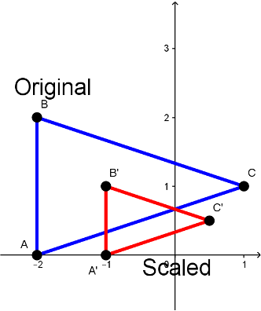

## Lesson 10: Transformations

#### Jon Macey, Ian Stephenson, Oleg Fryazinov 

- **Course:** BA Computer Animation and Visual Effects
- **Level:** 4 
- **Unit:** Procedural Content Creation

---

# Session outline

- **Title:** Transformations
- **What will you learn today:**
  - How to move, rotate and scale objects using the code

---

## Transformation: a definition

- A geometric transformation is a function which maps from a point set to itself or another point set.


--

## Classification of transformations

- From the geometric point of view, we can classify transformations according to the properties they preserve
  - Distances
  - Angles
  - Ratios between distances
  - Parallelism
  


--

## Affine transformations

- Affine transformation is a transformation that preserves 
  - Collinearity (all points lying on a line initially still lie on a line after transformation)
  - Ratios of distances (the midpoint of a line segment remains the midpoint after transformation)


--

## Affine transformations

- Affine transformations include
  - Translation
  - Rotation
  - Scaling
  - Shear
  - The composition of the transformation above


---

## Preparing the playground

[30.py](https://github.com/NCCA/PCCSlides/blob/main/Lecture10/code/30.py)

```python
from PIL import Image, ImageDraw

def draw_polyline(canvas, pointList, colour):
    #the function takes the list of points as an input, we need to convert to tuple
    pointTuple = tuple(pointList)
    #the line() function takes a tuple of points as a first argument
    canvas.line(pointTuple, colour)

im = Image.new("RGB", (640, 480), (100, 0, 20))
canvas = ImageDraw.Draw(im)
white = (255, 255, 255)
points = [(100, 100), (200, 100), (200, 200), (100, 200), (100, 100)]
draw_polyline(points, white)
im.show()
```

---

## Translation

- Translation is to move, or parallel shift, a point or points


--

## Translation formula

- Translation is defined by adding an offset:
- $x'=x+t_x$
- $y'=y+t_y$


--

## Translation: Python implementation

[31.py](https://github.com/NCCA/PCCSlides/blob/main/Lecture10/code/31.py)

```python
from PIL import Image, ImageDraw

def draw_polyline(canvas, pointList, colour):
    pointTuple = tuple(pointList)
    canvas.line(pointTuple, colour)

def translatePoints(points, dx, dy) -> list:
    newPoints = list()
    for p in points:
        newPoints.append((p[0] + dx, p[1] + dy))
    return newPoints

im = Image.new("RGB", (640, 480), (100, 0, 20))
canvas = ImageDraw.Draw(im)
white = (255, 255, 255)
green = (0, 255, 0)
points = [(100, 100), (200, 100), (200, 200), (100, 200), (100, 100)]
#draw original polyline
draw_polyline(points, white)
tx = 50 #shift for x
ty = 50 #shift for y
newPoints = translatePoints(points, tx, ty)
draw_polyline(newPoints, green)
im.show()
```

--

## Translation: Refining Python implementation

[31.py](https://github.com/NCCA/PCCSlides/blob/main/Lecture10/code/31.py)

```python
#!/usr/bin/env python3
# 32.py
from PIL import Image, ImageDraw

def draw_polyline(canvas, pointList, colour) -> None:
    #the function takes the list of points as an input, we need to convert to tuple
    pointTuple = tuple(pointList)
    #the line() function takes a tuple of points as a first argument
    canvas.line(pointTuple, colour)
    
def translatePoint(point, dx, dy) -> (float, float): #The function moves just one point given the offset
    return (point[0] + dx, point[1] + dy)

def translatePoints(points, dx, dy) -> list: #This function moves multiple points with the same offset
    newPoints = list()
    for p in points:
        newPoints.append(translatePoint(p, dx, dy))
    return newPoints


im = Image.new("RGB", (640, 480), (100, 0, 20))
canvas = ImageDraw.Draw(im)
white = (255, 255, 255)
red = (255, 0, 0)
yellow = (255, 255, 0)
green = (0, 255, 0)
cyan = (0, 255, 255)
blue = (0, 0, 255)
purple = (255, 0, 255)
rainbow = (red, yellow, green, cyan, blue, purple)
points = [(100, 100), (200, 100), (200, 200), (100, 200), (100, 100)]
tx = 40 #shift for x
ty = 40 #shift for y
for count in range(0, 6):
    draw_polyline(canvas, points, rainbow[count])
    points = translatePoints(points, 40, 40)
im.show()
```

---

## Scaling

- Scaling is a transformation that enlarges or shrinks the objects
  - Uniform (isotropic) scaling uses the same scaling factor in all directions
  - Non-uniform (anisotropic) scaling uses different scaling factors for different directions
- Scaling is expressed in relation to the origin




--

## Scaling formula

- Scaling is defined by multiplying coordinates by scale factors
- $x'=s_x x$
- $y'=s_y y$


--

## Scaling: Python implementation

[33.py](https://github.com/NCCA/PCCSlides/blob/main/Lecture10/code/33.py)

```python
from PIL import Image, ImageDraw

def draw_polyline(canvas, pointList, colour) -> None:
    pointTuple = tuple(pointList)
    canvas.line(pointTuple, colour)


def scalePoint(point, sx, sy) -> (float, float): #The function does non-uniform scaling for a point
    return (point[0] * sx, point[1] * sy)


def scalePoints(points, sx, sy) -> list: #The function does non-uniform scaling for a point set
    newPoints = list()
    for p in points:
        newPoints.append(scalePoint(p, sx, sy))
    return newPoints


im = Image.new("RGB", (640, 480), (100, 0, 20))
canvas = ImageDraw.Draw(im)
white = (255, 255, 255)
red = (255, 0, 0)
yellow = (255, 255, 0)
green = (0, 255, 0)
cyan = (0, 255, 255)
blue = (0, 0, 255)
purple = (255, 0, 255)
rainbow = (red, yellow, green, cyan, blue, purple)

points = [(100, 100), (200, 100), (200, 200), (100, 200), (100, 100)]
for count in range(0, 6):
    draw_polyline(canvas, points, rainbow[count])
    points = scalePoints(points, 1.1, 1.1)
im.show()
```

---

## Composition of transformations

- A composition of tramsformations involves 2 or more transformations applied to one shape or point.
- The order in which the transformations were applied often changed the outcome

--

### Composition of transformations: Python example

[34.py](https://github.com/NCCA/PCCSlides/blob/main/Lecture10/code/34.py)

```python
from PIL import Image, ImageDraw

def draw_polyline(canvas, pointList, colour) -> None:
    pointTuple = tuple(pointList)
    canvas.line(pointTuple, colour)

def translatePoint(point, dx, dy) -> (float, float):
    return (point[0] + dx, point[1] + dy)

def translatePoints(points, dx, dy) -> list:
    newPoints = list()
    for p in points:
        newPoints.append(translatePoint(p, dx, dy))
    return newPoints

def scalePoint(point, sx, sy) -> (float, float):
    return (point[0] * sx, point[1] * sy)

def scalePoints(points, sx, sy) -> list:
    newPoints = list()
    for p in points:
        newPoints.append(scalePoint(p, sx, sy))
    return newPoints

im = Image.new("RGB", (640, 480), (100, 0, 20))
canvas = ImageDraw.Draw(im)
white = (255, 255, 255)
red = (255, 0, 0)
yellow = (255, 255, 0)
green = (0, 255, 0)
cyan = (0, 255, 255)
blue = (0, 0, 255)
purple = (255, 0, 255)
rainbow = (red, yellow, green, cyan, blue, purple)

points = [(-0.5, -0.5), (0.5, -0.5), (0.5, 0.5), (-0.5, 0.5), (-0.5, -0.5)]

for count in range(0, 6):
    #note if you swap next two lines, you will get a different result
    newPoints = scalePoints(points, count * 80, count * 80)
    newPoints = translatePoints(newPoints, 320, 240)
    draw_polyline(canvas, newPoints, rainbow[count])
im.show()
```

---

## Rotation

- Rotation is a circular movement of an object around a centre of rotation
- For basic rotation a centre of rotation is the origin
- We will be talking about 2D rotation


--

## Rotation formula

- Rotation by arbitrary angle in **counter-clockwise direction**
- $x'=x cos(\phi)$
- $y'=x sin(\phi)$


--

## Rotation: Python implementation

[35.py](https://github.com/NCCA/PCCSlides/blob/main/Lecture10/code/35.py)

```python
from PIL import Image, ImageDraw
import math

def draw_polyline(canvas, pointList, colour) -> None:
    pointTuple = tuple(pointList)
    canvas.line(pointTuple, colour)


def rotatePoint(point, theta) -> (float, float):
    return (
        point[0] * math.cos(theta) + point[1] * math.sin(theta),
        -point[0] * math.sin(theta) + point[1] * math.cos(theta),
    )


def rotatePoints(points, theta) -> list:
    newPoints = list()
    for p in points:
        newPoints.append(rotatePoint(p, theta))
    return newPoints


im = Image.new("RGB", (640, 480), (100, 0, 20))
canvas = ImageDraw.Draw(im)
white = (255, 255, 255)
red = (255, 0, 0)
yellow = (255, 255, 0)
green = (0, 255, 0)
cyan = (0, 255, 255)
blue = (0, 0, 255)
purple = (255, 0, 255)
rainbow = (red, yellow, green, cyan, blue, purple)

points = [(100, 100), (200, 100), (200, 200), (100, 200), (100, 100)]
for count in range(0, 6):
    draw_polyline(canvas, points, rainbow[count])
    points = rotatePoints(points, 0.1)
im.show()
```

---

### Bringing it all together 

[36.py](https://github.com/NCCA/PCCSlides/blob/main/Lecture10/code/36.py)

```python
from PIL import Image, ImageDraw
import math

def draw_polyline(canvas, pointList, colour) -> None:
    pointTuple = tuple(pointList)
    canvas.line(pointTuple, colour)

def translatePoint(point, dx, dy) -> (float, float):
    return (point[0] + dx, point[1] + dy)

def translatePoints(points, dx, dy) -> list:
    newPoints = list()
    for p in points:
        newPoints.append(translatePoint(p, dx, dy))
    return newPoints

def scalePoint(point, sx, sy) -> (float, float):
    return (point[0] * sx, point[1] * sy)

def scalePoints(points, sx, sy) -> list:
    newPoints = list()
    for p in points:
        newPoints.append(scalePoint(p, sx, sy))
    return newPoints

def rotatePoint(point, theta) -> (float, float):
    return (
        point[0] * math.cos(theta) + point[1] * math.sin(theta),
        -point[0] * math.sin(theta) + point[1] * math.cos(theta),
    )

def rotatePoints(points, theta) -> list:
    newPoints = list()
    for p in points:
        newPoints.append(rotatePoint(p, theta))
    return newPoints

im = Image.new("RGB", (640, 480), (100, 0, 20))
canvas = ImageDraw.Draw(im)
white = (255, 255, 255)
red = (255, 0, 0)
yellow = (255, 255, 0)
green = (0, 255, 0)
cyan = (0, 255, 255)
blue = (0, 0, 255)
purple = (255, 0, 255)
rainbow = (red, yellow, green, cyan, blue, purple)

points = [(-0.5, -0.5), (0.5, -0.5), (0.5, 0.5), (-0.5, 0.5), (-0.5, -0.5)]

for count in range(0, 6):
    newPoints = scalePoints(points, count * 60, count * 60)
    newPoints = rotatePoints(newPoints, (count * 5) / 360.0 * 2 * math.pi)
    newPoints = translatePoints(newPoints, 320, 240)
    draw_polyline(canvas, newPoints, rainbow[count])
im.show()

```

--

### Time to play

[37.py](https://github.com/NCCA/PCCSlides/blob/main/Lecture10/code/37.py)

```python
from PIL import Image, ImageDraw
import math

def draw_polyline(canvas, pointList, colour) -> None:
    pointTuple = tuple(pointList)
    canvas.line(pointTuple, colour)

def translatePoint(point, dx, dy) -> (float, float):
    return (point[0] + dx, point[1] + dy)

def translatePoints(points, dx, dy) -> list:
    newPoints = list()
    for p in points:
        newPoints.append(translatePoint(p, dx, dy))
    return newPoints

def scalePoint(point, sx, sy) -> (float, float):
    return (point[0] * sx, point[1] * sy)

def scalePoints(points, sx, sy) -> list:
    newPoints = list()
    for p in points:
        newPoints.append(scalePoint(p, sx, sy))
    return newPoints

def rotatePoint(point, theta) -> (float, float):
    return (
        point[0] * math.cos(theta) + point[1] * math.sin(theta),
        -point[0] * math.sin(theta) + point[1] * math.cos(theta),
    )

def rotatePoints(points, theta) -> list:
    newPoints = list()
    for p in points:
        newPoints.append(rotatePoint(p, theta))
    return newPoints

im = Image.new("RGB", (640, 480), (100, 0, 20))
canvas = ImageDraw.Draw(im)
white = (255, 255, 255)
red = (255, 0, 0)
yellow = (255, 255, 0)
green = (0, 255, 0)
cyan = (0, 255, 255)
blue = (0, 0, 255)
purple = (255, 0, 255)
rainbow = (red, yellow, green, cyan, blue, purple)

points = [(-0.5, -0.5), (0.5, -0.5), (0.5, 0.5), (-0.5, 0.5), (-0.5, -0.5)]
for count in range(0, 50):
    newPoints = scalePoints(points, 10, 5)
    newPoints = rotatePoints(newPoints, math.cos(count * 10 / 360.0 * 2 * math.pi))
    newPoints = translatePoints(
        newPoints, count * 15, 240 + 30 * math.sin((count * 15) / 360.0 * 2 * math.pi)
    )
    draw_polyline(canvas, newPoints, rainbow[count % len(rainbow)])
im.show()
```

---

## One more example: brick wall

[brickwall.py](https://github.com/NCCA/PCCSlides/blob/main/Lecture10/code/brickwall.py)

```python
from PIL import Image, ImageDraw
import random
import math

def draw_polyline(canvas, pointList, colour) -> None:
    pointTuple = tuple(pointList)
    canvas.line(pointTuple, colour)

def draw_polygon(canvas, pointList, colour) -> None:
    pointTuple = tuple(pointList)
    canvas.polygon(pointTuple, colour, colour)

def translatePoint(point, dx, dy) -> (float, float):
    return (point[0] + dx, point[1] + dy)

def translatePoints(points, dx, dy) -> list:
    newPoints = list()
    for p in points:
        newPoints.append(translatePoint(p, dx, dy))
    return newPoints

def scalePoint(point, sx, sy) -> (float, float):
    return (point[0] * sx, point[1] * sy)

def scalePoints(points, sx, sy) -> list:
    newPoints = list()
    for p in points:
        newPoints.append(scalePoint(p, sx, sy))
    return newPoints

def rotatePoint(point, theta) -> (float, float):
    return (
        point[0] * math.cos(theta) + point[1] * math.sin(theta),
        -point[0] * math.sin(theta) + point[1] * math.cos(theta),
    )

def rotatePoints(points, theta) -> list:
    newPoints = list()
    for p in points:
        newPoints.append(rotatePoint(p, theta))
    return newPoints

cement = (200, 200, 200)
brick = (178, 34, 34)
resolution = 1024
step = 128
im = Image.new("RGB", (resolution, resolution), cement)
canvas = ImageDraw.Draw(im)

points = [(-0.5, -0.5), (0.5, -0.5), (0.5, 0.5), (-0.5, 0.5), (-0.5, -0.5)]
lineShift = True
for x in range(0, resolution+1, step):
    for y in range(0, resolution, math.floor(step/2)):
        newPoints = scalePoints(points, 115, 55)
        newPoints = rotatePoints(newPoints, random.uniform(-0.05,0.05))
        if lineShift :
            newPoints = translatePoints(newPoints, x, y)
            lineShift = False
        else :
            newPoints = translatePoints(newPoints, x+step/2, y)
            lineShift = True
        draw_polygon(canvas, newPoints, brick)
im.show()
```

---

# Conclusion

- **What have you learned today**
  - How to define and implement affine transformations
  - How to use composite transformation for procedural generation
- **Homework**
  - Bricks usually have imperfections that can be defined as random points inside the brick. Can you extend the example to implement it?

--

# Next time

- **What will you learn next time**
  - Loading images
  - Procedural image manipulation

--

# Q&A and discussion
- **Open Floor for Questions**
