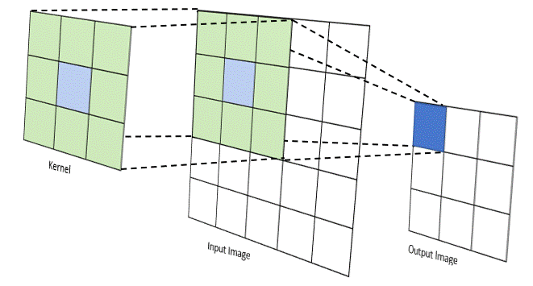

## Lesson 11: Image manipulation

#### Jon Macey, Ian Stephenson, Oleg Fryazinov 

- **Course:** BA Computer Animation and Visual Effects
- **Level:** 4 
- **Unit:** Procedural Content Creation

---

# Session outline

- **Title:** Image manipulation
- **What will you learn today:**
  - Algorithms behind digital compositing 
  - Basic image manipulation
  - Basic image compositing
  - Some simple effects

---

## Recap: Open image in PIL

- To open an image in PIL use *.open()* method

```python
from PIL import Image

im = Image.open("green.jpg")
im.show()
```

--

## Recap: Save image in PIL

- Saving an image can be achieved by using *.save()* method with PIL library’s Image module in Python.

```python
from PIL import Image

im = Image.open("green.jpg")
im.save("green_new.jpg")
```

---

## The pixel

- Digital images are made up of two-dimensional, or 2D, arrays (or grids) containing something called **pixels**.
  - Pixel = picture + element

```python
from PIL import Image

im = Image.open("green.jpg")
pixel = im.getpixel((100, 100)) #100th pixel from the left and 100th pixel from the top
print(pixel)
im.show()
```

--

## Image resolution

- **Resolution** is how many pixels make the width and the height of the image 
  - Example: 640 x 480 means the width is 640 pixels and the height is 480

```python
from PIL import Image

im = Image.open("green.jpg")
print(im.size)
print(f"Width is: {im.width}, heights is: {im.height}")
im.show()
```

---

## Pixels and colours

- Each pixel contains its own characteristics: 
  - the x,y position 
  - Colour
  - Transparency (opacity) 
  - Other attributes, such as blending mode etc. 
- Colours of all the pixels define what an image looks like

--

## RGB colours revisited

- The number of red, green, and blue is a level of intensity for each colour channel
- In today’s digital devices, pixels can produce 256 levels of light intensity per channel
- *16,777,216* unique colours!

---

## Image processing

- Read pixel, modify colour, write pixel
  - Basic mathematical operations: add, multiply, divide, power 
- Example: increase brightness by multiplying every pixel by a constant value

```python
from PIL import Image

im = Image.open("green.jpg")
for x in range(0, im.width):
    for y in range(0, im.height):
        pixel = im.getpixel((x, y))
        newPixel = (int(pixel[0]*1.25), int(pixel[1]*1.25), int(pixel[2]*1.25))
        im.putpixel((x, y), newPixel)
im.show()
```

--

## RGB multiply

- It can be useful to work with digital images as a group of channels
- Example: multiplication by different factors

```python
from PIL import Image

im = Image.open("green.jpg")
for x in range(0, im.width):
    for y in range(0, im.height):
        pixel = im.getpixel((x, y))
        newPixel = (int(pixel[0]*1.25), int(pixel[1]*1.25), int(pixel[2]*1.25))
        im.putpixel((x, y), newPixel)
im.show()
```

--

## RGB add

- Instead of multiplying, we can modify brightness by adding
- Unlike multiplication, blacks will be washed out

```python
from PIL import Image

im = Image.open("green.jpg")
for x in range(0, im.width):
    for y in range(0, im.height):
        pixel = im.getpixel((x, y))
        newPixel = (pixel[0]+40, pixel[1]+40, pixel[2]+40)
        im.putpixel((x, y), newPixel)
im.show()
```

--

## Gamma correction

- The Gamma Correction operation:
  - $O = I^{1/gamma}$

```python
from PIL import Image

def gammaCorrection(colour, gamma) -> tuple:
    unitColour = (colour[0]/255, colour[1]/255, colour[2]/255)
    gammaColour = (pow(unitColour[0], 1/gamma), pow(unitColour[1], 1/gamma), pow(unitColour[2], 1/gamma))
    return ((int(gammaColour[0]*255), int(gammaColour[1]*255), int(gammaColour[2]*255)))
    

im = Image.open("green.jpg")
gamma = 2
for x in range(0, im.width):
    for y in range(0, im.height):
        pixel = im.getpixel((x, y))
        newPixel = gammaCorrection(pixel, gamma)
        im.putpixel((x, y), newPixel)
im.show()
```


---

## Grayscaling

- Gray scaling is equivalent to changing a colour image to gray values.
- Image here is defined by intensity level, not colour
- There are many algorithms to convert colour to grayscale
  - Resulting colour is (Grayscale, Grayscale, Grayscale)

--

### Grayscaling: Weighted average method

- This method just averages the colour channels
- The formula is: 
  - Grayscale = (R + G + B) / 3

```python
from PIL import Image

im = Image.open("green.jpg")
for x in range(0, im.width):
    for y in range(0, im.height):
        pixel = im.getpixel((x, y))
        grey = int((pixel[0] + pixel[1] + pixel[2]) / 3)
        newPixel = (grey, grey, grey)
        im.putpixel((x, y), newPixel)
im.show()
```

--

### Grayscaling: Luminosity method

- This method is based on the fact that the human eye have a different level of sensitivity to different colors.
- The formula is: 
  - Grayscale = (0.299 × R) + (0.587 × G) + (0.114 × B)

```python
from PIL import Image

im = Image.open("green.jpg")
for x in range(0, im.width):
    for y in range(0, im.height):
        pixel = im.getpixel((x, y))
        grey = int((pixel[0] * 0.299 + pixel[1] * 0.587 + pixel[2] * 0.114))
        newPixel = (grey, grey, grey)
        im.putpixel((x, y), newPixel)
im.show()
```

--

### Grayscaling: Desaturation method

- This method process the image to black and white correspondingly by averaging the colour channels equally.
- The formula is: 
  - Grayscale = (max(R, G, B) + min(R, G, B)) / 2

```python
from PIL import Image

im = Image.open("green.jpg")
for x in range(0, im.width):
    for y in range(0, im.height):
        pixel = im.getpixel((x, y))
        grey = int((max(list(pixel))+min(list(pixel)))/2)
        newPixel = (grey, grey, grey)
        im.putpixel((x, y), newPixel)
im.show()
```

---

## Spatial filters

- All the previous methods had a direct mapping between input colour and output colour 
- **A spatial filter** is a tool that takes into account not just a single input pixel, but also a small neighbourhood
- **Examples**: Edge detection filter, Sharpen, Blurring 




--

## Blurring 

- **Overview**: The colours from neighbouring pixels are weighted averaged with the current pixel to produce a new image.
- The most common algorithm is the average of 9 pixels around and including the current pixel
- C(x,y) = (C(x-1,y-1) + C(x,y-1) + C(x+1,y-1) + C(x-1,y) + C(x,y) + C(x+1,y) + C(x-1,y+1) + C(x,y+1) + C(x+1,y+1)) / 9
  - Colour is calculated per channel

--

## Blurring: Python implementation

```python
from PIL import Image

im = Image.open("green.jpg")
for x in range(1, im.width-1):
    for y in range(1, im.height-1):
        averageR = 0
        averageG = 0
        averageB = 0
        pixels = [(x-1,y-1),(x,y-1),(x+1,y-1),(x-1,y),(x,y),(x+1,y),(x-1,y+1),(x,y+1),(x+1,y+1)]
        for coordinate in pixels:
            pixel = im.getpixel(coordinate)
            averageR = averageR + pixel[0]
            averageG = averageG + pixel[1]
            averageB = averageB + pixel[2]
        averageR = int(averageR / 9)
        averageG = int(averageG / 9)
        averageB = int(averageB / 9)
        newPixel = (averageR, averageG, averageB)
        im.putpixel((x, y), newPixel)
im.show()
```

---

## Image Compositing

- The core of **Image Compositing** is the process of combining two or more images
- We will use *multisource* operators
  - The colour is calculated per channel
  - Basic equations as previously

--

## Add

- One of the most common and the simpliest multisource operators
- Output = ColourA + ColourB

```python
from PIL import Image

im1 = Image.open("background.jpg") 
im2 = Image.open("green.jpg")

for x in range(0, im1.width):
    for y in range(0, im1.height):
        pixel1 = im1.getpixel((x, y))
        pixel2 = im2.getpixel((x, y))
        newPixel = (pixel1[0]+pixel2[0], pixel1[1]+pixel2[1], pixel1[2]+pixel2[2])
        im1.putpixel((x, y), newPixel)
im1.show()
```

--

## Mix

- Mix is a specialised version of Add operation 
- Specifically, it is the weighted normalised addition of two images
- Output = ColourA x MV + ColourB x (1-MV)
  - MV is a mix value between 0 and 1: 0 results in imageB, 1 results in imageA

--

## Mix: Python implementation
  
```python
from PIL import Image

im1 = Image.open("background.jpg") 
im2 = Image.open("green.jpg")

mixValue = 0.2
oneMinusMV = 1 - mixValue

for x in range(0, im1.width):
    for y in range(0, im1.height):
        pixel1 = im1.getpixel((x, y))
        pixel2 = im2.getpixel((x, y))
        newR = int(pixel1[0]*mixValue + pixel2[0]*oneMinusMV)
        newG = int(pixel1[1]*mixValue + pixel2[1]*oneMinusMV)
        newB = int(pixel1[2]*mixValue + pixel2[2]*oneMinusMV)
        newPixel = (newR, newG, newB)
        im1.putpixel((x, y), newPixel)
im1.show()
```


---

## The Matte Image

- Combining different images needs to be a process with as much control as possible
- We need to limit which portions of images we will be using, and which will not
- Matte (mask) image is a greyscale image that defines how we compose images
  - Often matte information is stored in the alpha channel in RGBA colour
  - Alpha component (A) is transparency

--

## Creating a matte: chroma-keying

- Creating a mask from existing scene procedurally can be done using many different methods
- Chroma-keying is about picking a colour (or range of colours) and isolate pixels that fall within the hue range of the colour
- You will learn more about that next semester!

--

## Chroma-keying: Python implementation

- The idea in the code below: if the value for G is high and values for R and B combined is significantly lower than G, we note the pixel

```python
im = Image.open("green.jpg")
for x in range(0, im.width):
    for y in range(0, im.height):
        pixel = im.getpixel((x, y))
        if pixel[1] > (pixel[0] + pixel[2]) * 0.65:
            newPixel = (0, 0, 0)
            im.putpixel((x, y), newPixel)
im.show()

```

--

## Matte extraction: Python implementation

```python
from PIL import Image

fg = Image.open("green.jpg")
mask = Image.new("L", fg.size, 0)
for x in range(0, fg.width):
    for y in range(0, fg.height):
        pixel = fg.getpixel((x, y))
        if pixel[1] > (pixel[0] + pixel[2]) * 0.65:
            mask.putpixel((x, y), (0))
        else:
            mask.putpixel((x, y), (255))
mask.show()
```

---

## Over operation

- One of the most important operation in digital compositing
- The Over operator is specifically designed to layer a four-channel image over another image. 
- Output = ColourA + ColourB x (1 - AlphaA)
  - Assumes alpha channel is created using matte extraction
  - A: foreground, B: background
- If alpha is either 0 or 1 (as in matte), can be simplified to selection

--

## Over operation: Python implementation

```python
from PIL import Image

fg = Image.open("green.jpg")
bg = Image.open("background.jpg")
mask = Image.new("L", fg.size, 0)
#matte extraction
for x in range(0, bg.width):
    for y in range(0, bg.height):
        pixel = fg.getpixel((x, y))
        if pixel[1] < (pixel[0] + pixel[2]) * 0.65:
            mask.putpixel((x, y), (255))
        else:
            mask.putpixel((x, y), (0))

result = Image.new("RGB", bg.size, 0)
for x in range(0, result.width):
    for y in range(0, result.height):
        maskPixel = mask.getpixel((x, y))
        fgPixel = fg.getpixel((x, y))
        bgPixel = bg.getpixel((x, y))
        if maskPixel > 128:
            result.putpixel((x, y), fgPixel)
        else:
            result.putpixel((x, y), bgPixel)
result.show()
```

---

### Compositing: bringing it all together
```python
from PIL import Image

def key(img, min) -> Image:
    mask = Image.new("L", img.size, 0)
    for x in range(0, img.width):
        for y in range(0, img.height):
            pixel = img.getpixel((x, y))
            if pixel[1] < (pixel[0] + pixel[2]) * 0.65:
                mask.putpixel((x, y), (255))
            else:
                mask.putpixel((x, y), (0))
    return mask


def over(fg, bg, mask) -> Image:
    result = Image.new("RGB", bg.size, 0)
    for x in range(0, result.width):
        for y in range(0, result.height):
            maskPixel = mask.getpixel((x, y))
            fgPixel = fg.getpixel((x, y))
            bgPixel = bg.getpixel((x, y))
            if maskPixel > 128:
                result.putpixel((x, y), fgPixel)
            else:
                result.putpixel((x, y), bgPixel)
    return result


fg = Image.open("green.jpg")
bg = Image.open("background.jpg")
mask = key(fg, 0.65)
mask.show()
result = over(fg, bg, mask)
result.show()
```

---

### Advanced example: Over operation in RGBA and advanced chroma-keying
```python
from PIL import Image


def key(img, min, max) -> Image:
    result = Image.new("RGBA", img.size, 0)
    delta = max - min
    oodelta = 1.0 / delta
    for x in range(0, img.width):
        for y in range(0, img.height):
            pixel = img.getpixel((x, y))
            alpha = (pixel[1] - (pixel[0] + pixel[2]) * 0.5) / 255.0
            alpha = (alpha - min) * oodelta
            alpha = 1 - alpha
            if alpha < 0:
                alpha = 0
            if alpha > 1:
                alpha = 1
            newPixel = (
                int(pixel[0] * alpha),
                int(pixel[1] * alpha),
                int(pixel[2] * alpha),
                int(255 * alpha),
            )
            result.putpixel((x, y), newPixel)
    return result


def blendRGBA(fg, bg) -> tuple:
    a = fg[3] / 255.0
    return (
        int(fg[0] + bg[0] * (1 - a)),
        int(fg[1] + bg[1] * (1 - a)),
        int(fg[2] + bg[2] * (1 - a)),
        1,
    )


def over(fg, bg) -> Image:
    result = Image.new("RGB", bg.size, 0)
    for x in range(0, result.width):
        for y in range(0, result.height):
            fgPixel = fg.getpixel((x, y))
            bgPixel = bg.getpixel((x, y))
            opPixel = blendRGBA(fgPixel, bgPixel)
            result.putpixel((x, y), opPixel)
    return result


fg = Image.open("green.jpg")
bg = Image.open("background.jpg")
newFg = key(fg, 0.05, 0.1)
result = over(newFg, bg)
result.show()
```

---

# Conclusion

- **What have you learned today**
  - Image processing algorithms: gamma correction, grayscaling, blurring
  - Image compositing algorithms: matte extraction, chroma keying, over operation
- **Homework**
  - Understand the code in the advanced example is more than enough

--

# Next time

- **What will you learn next time**
  - How to work with files in Python
  - Loading and saving .obj files

--

# Q&A and discussion
- **Open Floor for Questions**

