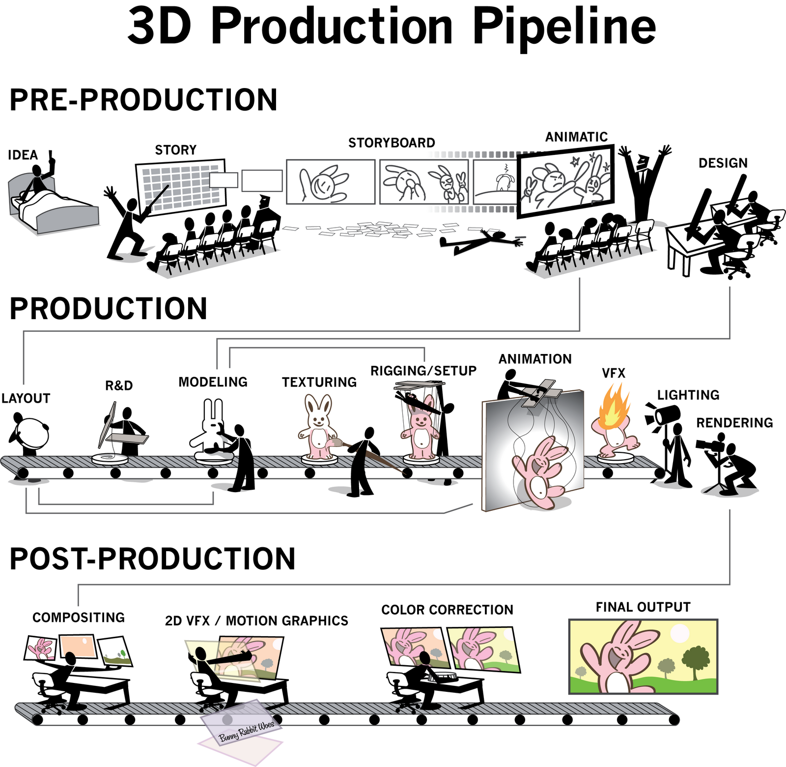
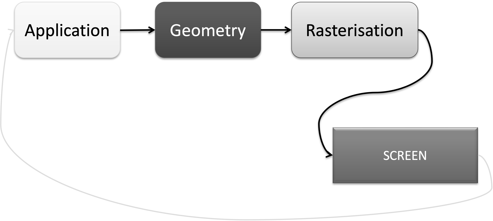

## Lesson 13: Going interactive

#### Jon Macey, Ian Stephenson, Oleg Fryazinov 

- **Course:** BA Computer Animation and Visual Effects
- **Level:** 4 
- **Unit:** Procedural Content Creation

---

# Session outline

- **Title:** Going interactive
- **What will you learn today:**
  - Introduction to pygame library 
  - How to read user mind with input

---

## Recap: Libraries


---

## 3D production pipeline



---

## Real-time graphics pipeline



--

### Real-time graphics pipeline: explanation

- **Application**: prepare your models, textures, lights, effects etc before the rendering stage
- **Geometry**: collect all the geometry to be rendered: meshes, sprites, volumetrics etc
- **Rasterisation**: converting geometry to pixels, takes place at the rendering engine and / or the graphics card
- Basically, we generate a lot of images in a second 

---

### Interactive applications with Pygame

- What is Pygame?
  - **Pygame** is a popular Python library used to create games and interactive applications.
  - Provides tools for handling graphics, sounds, and user inputs.
- Why use Pygame?
  - Ideal for beginners learning game development and interactive programming concepts.
  - Great for interactive graphics

---

## The Pygame game loop

- Game loop is a continuous loop that: 
  - Processed user input
  - Updates game state
  - Draws graphics on the screen
- User input is handled by **events**

--

## The Pygame game loop example

```python
import pygame   #we will need core pygame functionality
import pygame.draw #this module will be needed for drawing on the screen

pygame.init()   #this is an essential line to make pygame working

width = 640     #width of the game window
height = 480    #height of the game window
screen = pygame.display.set_mode((width, height)) #create the game window
clock = pygame.time.Clock() #use the clock to ensure we updating the window not too often 
running = True  #the variable to ensure the game loop
white = (255,255,255)
black = (0,0,0)

#the game loop
while running:
    screen.fill(black) #clear the window by filling the space with the background colour
    #draw two lines
    pygame.draw.line(screen, white, (0,0), (20,20), 10) 
    pygame.draw.line(screen, white, (20,0), (0,20), 10)
    
    #event management
    for event in pygame.event.get(): #if we received an event
        if event.type == pygame.QUIT: #if the event is "quit game"
            running = False         #then we set the variable allowing for the loop to stop
    pygame.display.flip()       #render
    clock.tick(30)              #wait until we run with 30 frames per second or less
#end of the program

```

--
### The Pygame game loop example: explanation

- To work properly, pygame needs to be initialised: *pygame.init()*
- The game loop is implemented using *while* loop with variable that can only be changed when we receive an appropriate event

---

## User input

- By now we draw images procedurally, but they could not be changed after they were generated
- Now let we create the program that can change the image while running
- We use the keyboard

--

## Handling user input

- Use pygame.event.get() to handle events like key presses and mouse movements.
- Common events:
  - **QUIT**: Closing the application
  - **KEYDOWN**: Key pressed
  - **MOUSEBUTTONDOWN**: Mouse button pressed

--

## Handling keyboard

- Easier way to handle keyboard is to use *pygame.key.get_pressed()*
  - The function returns a list of keys and their states (pressed / not pressed)
  - The key for "a" is pygame.K_a, the key for '0' is pygame.K_0, for arrow up is pygame.K_UP

--

## Handling keyboard: example
```python
import pygame   #we will need core pygame functionality
import pygame.draw #this module will be needed for drawing on the screen

pygame.init()   #this is an essential line to make pygame working

width = 640     #width of the game window
height = 480    #height of the game window
screen = pygame.display.set_mode((width, height)) #create the game window
clock = pygame.time.Clock() #use the clock to ensure we updating the window not too often 
running = True  #the variable to ensure the game loop
white = (255,255,255)
black = (0,0,0)

posX = 0
posY = 0

#the game loop
while running:
    screen.fill(black) #clear the window by filling the space with the background colour
    #draw two lines
    pygame.draw.line(screen, white, (posX,posY), (posX+20,posY+20), 10) 
    pygame.draw.line(screen, white, (posX+20,posY+0), (posX+0,posY+20), 10)

    key = pygame.key.get_pressed()
    if key[pygame.K_UP]:
        posY = posY - 1
    if key[pygame.K_DOWN]:
        posY = posY + 1
    if key[pygame.K_RIGHT]:
        posX = posX + 1
    if key[pygame.K_LEFT]:
        posX = posX - 1
    #event management
    for event in pygame.event.get(): #if we received an event
        if event.type == pygame.QUIT: #if the event is "quit game"
            running = False         #then we set the variable allowing for the loop to stop
    pygame.display.flip()       #render
    clock.tick(30)              #wait until we run with 30 frames per second or less
```

---

# Conclusion

- **What have you learned today**
  - Image processing algorithms: gamma correction, grayscaling, blurring
  - Image compositing algorithms: matte extraction, chroma keying, over operation
- **Homework**
  - Understand the code in the advanced example is more than enough

--

# Next time

- **What will you learn next time**
  - How to work with files in Python
  - Loading and saving .obj files

--

# Q&A and discussion
- **Open Floor for Questions**

