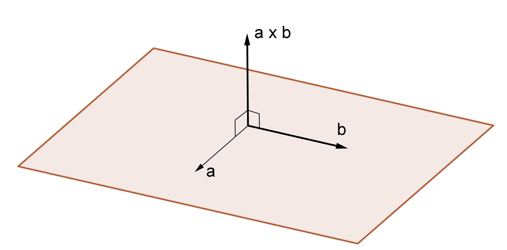

## Lesson 13 : Vector products and normals 

#### Jon Macey, Ian Stephenson, Oleg Fryazinov 

- **Course:** BA Computer Animation and Visual Effects
- **Level:** 4 
- **Unit:** Procedural Content Creation

---

# Session outline

- **Title:** Vector products and normals
- **What will you learn today:**
  - What products exist for vectors
  - The obj file format


---

## Recap: Obj components

- The OBJ file format consists of a series of lines, each of which describes a different component of the mesh.
- The most important components are:
  - ```v``` - a vertex position
  - ```vn``` - a vertex normal
  - ```vt``` - a vertex texture coordinate
  - ```f``` - a face

--

## Recap: Vectors

- A **vector** is a quantity that has length and direction
- A geometric vector is defined by a directed line segment


---

## Vector products

- When discussing vectors, we discussed addition, subtraction and multiplication by a scalar
- We have not discussed vector multiplication
- There are more than one way to multiply two vectors
  - Also called products

---

## Dot product

- Dot product is one of the essential vector operations in computer graphics
- Shading, reflections, camera control etc


--

## Dot product: a definition

- Given two n-dimensional vectors $ \mathbf{a} = (a_1, a_2, ..., a_n)$ and $ \mathbf{b}=(b_1, b_2, ..., b_n)$
- The **dot product** is defined as $\mathbf{a} \cdot \mathbf{b}$ = $a_1 b_1 + a_2 b_2 + ... a_n b_n$
- The result of the dot product is a real number (scalar)
  - The dot product is also called **scalar product**

--

## Dot product: an example

- $\mathbf{a} = (3, 2, 1)$ ,  $ \mathbf{b} = (-1, -2, 2)$
- $\mathbf{a} \cdot \mathbf{b} = 3\cdot(-1)+2\cdot(-2)+(1\cdot2) = -5$

--

### Dot product: angle between vectors

- If $\mathbf{a}$ and $\mathbf{b}$ are two non-zero vectors, the angle $α$ , $0 ≤ α ≤ π$, between $\mathbf{a}$ and $\mathbf{b}$ is determined by the formula:
- $cos(\alpha) = \frac{\mathbf{a} \cdot \mathbf{b}}{\left\| \mathbf{a} \right\| \left\| \mathbf{b} \right\|}$

--

### Angle between vectors: an example

- $\mathbf{a} = (3, 2, 1)$ ,  $ \mathbf{b} = (-1, -2, 2)$
- $\mathbf{a} \cdot \mathbf{b} = 3\cdot(-1)+2\cdot(-2)+(1\cdot2) = -5$
- $cos(\alpha) = \frac{\mathbf{a} \cdot \mathbf{b}}{\left\| \mathbf{a} \right\| \left\| \mathbf{b} \right\|}=\frac{-5}{3\sqrt{14}}$

--

## Geometric meaning of dot product

- If $\mathbf{a}$ and $\mathbf{b}$ are *two unit* vectors, their lengths are equal to 1
- $cos(\alpha) = \mathbf{a} \cdot \mathbf{b}$
  - Note this formula works only for unit vectors!
- A geometric meaning of the dot product: cosine of the angle between two unit directions

---

## The cross product

- With the dot product, the **cross product** is also very important operation in 3D graphics
  - Normal calculation, point triangle membership etc


- https://www.shadertoy.com/view/WdS3RK

--

## The cross product: definition

- Given two 3D vectors $ \mathbf{a} = (a_1, a_2, a_3)$ and $ \mathbf{b}=(b_1, b_2, b_3)$
- The **cross product** (the vector product) is a vector
- $\mathbf{a} \times \mathbf{b}$ = ($a_2 b_3 - a_3 b_2$, $a_3 b_1 - a_1 b_3$, $a_1 b_2 - a_2 b_1$)

--

## The cross product: example

- $\mathbf{a} = (3, 2, 1)$ ,  $ \mathbf{b} = (-1, -2, 2)$
  - $\mathbf{a} \times \mathbf{b} =$ 
  - $=(2\cdot2 - 1 \cdot(-2), 1\cdot(-1) - 3\cdot2, 3\cdot(-2) - 2\cdot(-1) =$
  - $=(6, -7, -4)$

--

### The cross product: geometric meaning

- The vector $\mathbf{a} \times \mathbf{b}$ is orthogonal to the plane containing vectors $\mathbf{a}$ and $\mathbf{b}$, it is called **the normal** for this plane
- The direction of the cross product is given by the right-hand rule



--

### The cross product: geometric meaning

- The direction of the vector $\mathbf{a} \times \mathbf{b}$ is orthogonal to the plane containing $\mathbf{a}$ and $\mathbf{b}$, given the right-hand rule
- The length of the cross product is given by the formula
  - $\left\|\mathbf{a} \times \mathbf{b} \right\| = \left\| \mathbf{a} \right\| \left\| \mathbf{b} \right\| sin(\alpha)$
  - $α$ is the angle between $\mathbf{a}$ and $\mathbf{b}$

---

## Vector products

- Other vector products exist
  - For example, see books ["Foundations of Game Engine Development"](https://foundationsofgameenginedev.com/)
- However, in computer graphics applications these two are the most used
- We will use the cross product to calculate normals for our .Obj writer

--

## Calculating normals in Python

```python
#!/usr/bin/env python3

def calc_normal(v1, v2) :
    
    n=[v1[1]*v2[2]-v1[2]*v2[1], v1[2]*v2[0]-v1[0]*v2[2], v1[0]*v2[1]-v1[1]*v2[0]]
    # normalize the normal
    length = math.sqrt((n[0]**2 + n[1]**2 + n[2]**2))
    if length == 0:
        return n
    n[0] /= length
    n[1] /= length
    n[2] /= length
    return n

```

--

## Code explanation

- First, we calculate the cross product given the formula
  - $\mathbf{a} \times \mathbf{b}$ = ($a_2 b_3 - a_3 b_2$, $a_3 b_1 - a_1 b_3$, $a_1 b_2 - a_2 b_1$)
- Then, we normalise the resulting vector by multiplying it by inverse of its length
  - Simply speaking, dividing the vector components by its length

---

## Recap: Python ObjWriter 

```python
#!/usr/bin/env python3


triangle = [[2.0, 0.0, 0.0], [0.0, 4.0, 0.0], [-2.0, 0.0, 0.0]]

faces = [[0, 1, 2]]


with open("triangle1.obj", "w") as file:
    for vertex in triangle:
        file.write(f"v {vertex[0]} {vertex[1]} {vertex[2]}\n")
    # write the faces Note these are 1-based indices
    for face in faces:
        file.write(f"f {face[0]+1} {face[1]+1} {face[2]+1}\n")

```

--

## Adding Normals

- Normals are vectors that are perpendicular to the surface of the mesh at each vertex.
- They are used to calculate the shading of the mesh.
- We can add normals to our OBJ file by adding lines like this:

```
vn 0.0 0.0 1.0
```

- This line defines a normal vector pointing straight  in the z-direction.


--

## Calculating Normals

- To calculate the normals for a triangle mesh, we can use the cross product of the edges of the triangle.
- The cross product of two vectors gives a vector that is perpendicular to both of them.
- We can calculate the normal for a triangle by taking the cross product of two of its edges.
- For example, the normal of a triangle with vertices A, B, and C is given by the cross product of the vectors AB and AC.

--

## Python ObjWriter

- We can add normals to our OBJ file by calculating them for each face and writing them to the file.

```python
#!/usr/bin/env python3

def calc_normal(v1, v2) :
    
    n=[v1[1]*v2[2]-v1[2]*v2[1], v1[2]*v2[0]-v1[0]*v2[2], v1[0]*v2[1]-v1[1]*v2[0]]
    # normalize the normal
    length = math.sqrt((n[0]**2 + n[1]**2 + n[2]**2))
    if length == 0:
        return n
    n[0] /= length
    n[1] /= length
    n[2] /= length
    return n

triangle = [[2.0, 0.0, 0.0], [0.0, 4.0, 0.0], [-2.0, 0.0, 0.0]]

faces = [[0, 1, 2]]

normals=[]
normals.append(calc_normal(triangle[0], triangle[1]))
normals.append(calc_normal(triangle[1], triangle[2]))
normals.append(calc_normal(triangle[2], triangle[0]))

with open("triangle2.obj", "w") as file:
    for vertex in triangle:
        file.write(f"v {vertex[0]} {vertex[1]} {vertex[2]}\n")
    for normal in normals:
        file.write(f"vn {normal[0]} {normal[1]} {normal[2]}\n")
    # write the faces Note these are 1-based indices
    for face in faces:
        file.write(f"f {face[0]+1}//{face[0]+1} {face[1]+1}//{face[1]+1} {face[2]+1}//{face[2]+1}\n")
        
```

--

## Python ObjWriter

- This will write out a simple triangle mesh with normals to a file called ```triangle2.obj```
- We can then open this file in a 3D application such as Maya to view the mesh.
- You will notice there are no texture coordinates in this file so the face format is ```v//n```
- we will add texture coordinates next

---

## Adding Texture Coordinates

- Texture coordinates are used to map a 2D image onto a 3D mesh.
- They are typically given as two floating-point numbers (u, v) that specify the position of the texture on the mesh.
- We can add texture coordinates to our OBJ file by adding lines like this:

```
vt 0.0 0.0
vt 1.0 0.0
vt 0.0 1.0
```

--

## Python ObjWriter

- the uv index is inbetween the vertex and normal index

```python
f v/vt/n v/vt/n v/vt/n
```

- again it is an index into the list of texture coordinates

---

## A Cube

- A cube mesh contains six faces, each with four vertices We can define it as follows

```
#!/usr/bin/env python3
import math
# unit cube around the origin centered at 0,0,0 with sides of length 0.5
cube_verts=[
    [-0.5, -0.5, -0.5], # back bottom left
    [0.5, -0.5, -0.5], # back bottom right
    [0.5, 0.5, -0.5], # back top right
    [-0.5, 0.5, -0.5], # back top left
    [-0.5, -0.5, 0.5], # front bottom left
    [0.5, -0.5, 0.5], # front bottom right
    [0.5, 0.5, 0.5], # front top right
    [-0.5, 0.5, 0.5] # front top left
]

# normals for each face
cube_normals=[
    [0, 0, -1], # pointing out of the back
    [0, 0, 1], # pointing out of the front
    [0, -1, 0], # pointing out of the bottom
    [0, 1, 0], # pointing out of the top
    [-1, 0, 0], # pointing out of the left
    [1, 0, 0] # pointing out of the right
]

# texture coordinates

cube_uv=[
    [0, 0], # bottom left
    [1, 0], # bottom right
    [1, 1], # top right
    [0, 1] # top left
]

## todo write out the face data note we can share normals and uv's
## the back face is done for you.
faces=[
    [1, 1, 1], [2, 2, 1], [3, 3, 1],[4, 4, 1], # back face 
]

with open("cube.obj", "w") as file:
    for vertex in cube_verts:
        file.write(f"v {vertex[0]} {vertex[1]} {vertex[2]}\n")
    for normal in cube_normals:
        file.write(f"vn {normal[0]} {normal[1]} {normal[2]}\n")
    for st in cube_uv :
        file.write(f"vt {st[0]} {st[1]}\n")
    # write the faces Note these are 1-based indices
    for i in range(0, len(faces), 4):
        # for ease we can build a string and write it in one go
        file.write(f"f {faces[i][0]}/{faces[i][1]}/{faces[i][2]}")
        file.write(f"  {faces[i+1][0]}/{faces[i+1][1]}/{faces[i+1][2]}") 
        file.write(f"  {faces[i+2][0]}/{faces[i+2][1]}/{faces[i+2][2]}")
        file.write(f"  {faces[i+3][0]}/{faces[i+3][1]}/{faces[i+3][2]}\n")
```

---


# Conclusion

- **What have you learned today**
  - Vector products
  - More about the structure of .obj, including normals and texture coordinates
- **Homework**
  - Using the code above write the remaining faces of the cube, check in Maya if the file is correct

--

# Next time

- **What will you learn next time**
  - How to create games with Pygame
  - Procedural content generation for games 

--

# Q&A and discussion
- **Open Floor for Questions**


