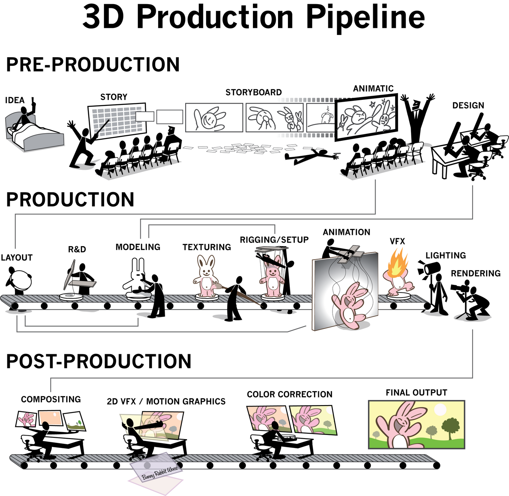
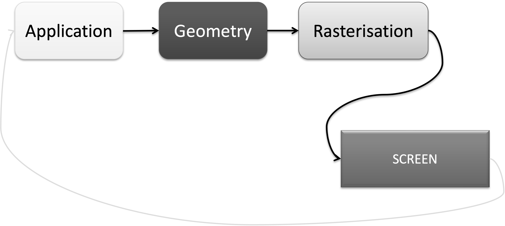

## Lesson 14: Going interactive

#### Jon Macey, Ian Stephenson, Oleg Fryazinov 

- **Course:** BA Computer Animation and Visual Effects
- **Level:** 4 
- **Unit:** Procedural Content Creation

---

# Session outline

- **Title:** Going interactive
- **What will you learn today:**
  - Introduction to pygame library 
  - How to read user mind with input

---

## Recap: Libraries

```python
import math
from PIL import Image
```

---




---

## Real-time graphics pipeline



--

### Real-time graphics pipeline: explanation

- **Application**: prepare your models, textures, lights, effects etc before the rendering stage
- **Geometry**: collect all the geometry to be rendered: meshes, sprites, volumetrics etc
- **Rasterisation**: converting geometry to pixels, takes place at the rendering engine and / or the graphics card
- Basically, we generate a lot of images in a second 

---

### Interactive applications with Pygame

- What is Pygame?
  - **Pygame** is a popular Python library used to create games and interactive applications.
  - Provides tools for handling graphics, sounds, and user inputs.
- Why use Pygame?
  - Ideal for beginners learning game development and interactive programming concepts.
  - Great for interactive graphics

--

## Pygame: a quick start

- *import pygame*
- Ensure pygame is initialised with *pygame.init()*.
- Some commands are similar to PIL, but check the syntax in examples later this session!

---

## The Pygame game loop

- Game loop is a continuous loop that: 
  - Processed user input
  - Updates game state
  - Draws graphics on the screen
- User input is handled by **events**

--

## The Pygame game loop example

[1_basic_pygame.py](https://github.com/NCCA/PCCSlides/blob/main/Lecture14/code/1_basic_pygame.py)

```python
import pygame   #we will need core pygame functionality
import pygame.draw #this module will be needed for drawing on the screen

pygame.init()   #this is an essential line to make pygame working

width = 640     #width of the game window
height = 480    #height of the game window
screen = pygame.display.set_mode((width, height)) #create the game window
clock = pygame.time.Clock() #use the clock to ensure we updating the window not too often 
running = True  #the variable to ensure the game loop
white = (255,255,255)
black = (0,0,0)

#the game loop
while running:
    screen.fill(black) #clear the window by filling the space with the background colour
    #draw two lines
    pygame.draw.line(screen, white, (0,0), (20,20), 10) 
    pygame.draw.line(screen, white, (20,0), (0,20), 10)
    
    #event management
    for event in pygame.event.get(): #if we received an event
        if event.type == pygame.QUIT: #if the event is "quit game"
            running = False         #then we set the variable allowing for the loop to stop
    pygame.display.flip()       #render
    clock.tick(30)              #wait until we run with 30 frames per second or less
#end of the program

```

--

### The Pygame game loop example: explanation

- To work properly, pygame needs to be initialised: *pygame.init()*
- The game loop is implemented using *while* loop with variable that can only be changed when we receive an appropriate event

---

## User input

- By now we draw images procedurally, but they could not be changed after they were generated
- Now let we create the program that can change the image while running
- User will provide an input for the program

--

## Handling user input

- Use *pygame.event.get()* to handle events like key presses and mouse movements.
- Common events:
  - **QUIT**: Closing the application
  - **KEYDOWN**: Key pressed
  - **MOUSEBUTTONDOWN**: Mouse button pressed

--

### Event handling in the game loop

- *pygame.event.get()* should be run inside the game loop if we want the pygame program processing events

```python
for event in pygame.event.get():
 # then check what event.type is 
```

- Some events can be handled separately, but *pygame.event.get()* should be called nevertheless

---

## Handling keyboard

- Easier way to handle keyboard is to use *pygame.key.get_pressed()* after *pygame.event.get()* is called
  - The function returns a list of keys and their states (pressed / not pressed)
  - The key for "a" is pygame.K_a, the key for '0' is pygame.K_0, for arrow up is pygame.K_UP

--

## Handling keyboard: example

[2_keyboard.py](https://github.com/NCCA/PCCSlides/blob/main/Lecture14/code/2_keyboard.py)

```python
import pygame   #we will need core pygame functionality
import pygame.draw #this module will be needed for drawing on the screen

pygame.init()   #this is an essential line to make pygame working

width = 640     #width of the game window
height = 480    #height of the game window
screen = pygame.display.set_mode((width, height)) #create the game window
clock = pygame.time.Clock() #use the clock to ensure we updating the window not too often 
running = True  #the variable to ensure the game loop
white = (255,255,255)
black = (0,0,0)

posX = 0
posY = 0

#the game loop
while running:
    screen.fill(black) #clear the window by filling the space with the background colour
    #draw two lines
    pygame.draw.line(screen, white, (posX,posY), (posX+20,posY+20), 10) 
    pygame.draw.line(screen, white, (posX+20,posY+0), (posX+0,posY+20), 10)

    key = pygame.key.get_pressed()
    if key[pygame.K_UP]:
        posY = posY - 1
    if key[pygame.K_DOWN]:
        posY = posY + 1
    if key[pygame.K_RIGHT]:
        posX = posX + 1
    if key[pygame.K_LEFT]:
        posX = posX - 1
    #event management
    for event in pygame.event.get(): #if we received an event
        if event.type == pygame.QUIT: #if the event is "quit game"
            running = False         #then we set the variable allowing for the loop to stop
    pygame.display.flip()       #render
    clock.tick(30)              #wait until we run with 30 frames per second or less
```

--

## Handling keyboard: tips

- pygame.key.get_pressed() is updated every game loop. 
  - If we want to check if the key was pressed and released, is it better to check for *pygame.KEYUP* event
  - This should happen inside handling of *pygame.event.get()*
- clock.tick(t) allows refreshing the screen and update the keyboard with *t* frames per second

---

## Handling mouse

- Position of the mouse can be queried with *pygame.mouse.get_pos()*
- Similar to keyboard, you can handle mouse buttons with *pygame.mouse.get_pressed()*

[2_mouse.py](https://github.com/NCCA/PCCSlides/blob/main/Lecture14/code/2_mouse.py)

```python
import pygame   #we will need core pygame functionality
import pygame.draw #this module will be needed for drawing on the screen

pygame.init()   #this is an essential line to make pygame working

width = 640     #width of the game window
height = 480    #height of the game window
screen = pygame.display.set_mode((width, height)) #create the game window
clock = pygame.time.Clock() #use the clock to ensure we updating the window not too often 
running = True  #the variable to ensure the game loop
white = (255,255,255)
red = (255,0,0)
black = (0,0,0)

posX = 0
posY = 0

#the game loop
while running:
    screen.fill(black) #clear the window by filling the space with the background colour
    #the colour of the cross object is white by default
    current_colour = white
    #set position of the cross to be the position of the mouse cursor
    mouse_pos = pygame.mouse.get_pos()
    posX = mouse_pos[0]
    posY = mouse_pos[1]

    #if left mouse button is pressed, change the drawing colour to red
    key = pygame.mouse.get_pressed()
    if key[0]:
        current_colour = red

    #draw the cross in the current position with the current colour
    pygame.draw.line(screen, current_colour, (posX,posY), (posX+20,posY+20), 10) 
    pygame.draw.line(screen, current_colour, (posX+20,posY+0), (posX+0,posY+20), 10)

    #event management
    for event in pygame.event.get(): #if we received an event
        if event.type == pygame.QUIT: #if the event is "quit game"
            running = False         #then we set the variable allowing for the loop to stop
    pygame.display.flip()       #render
    clock.tick(30)              #wait until we run with 30 frames per second or less
```

--

###Handling mouse and keyboard: troubleshooting

- Make sure your code has *pygame.event.get()* within your main game loop
  - The *get_pressed* function does not generate events itself!
- For the mouse, the button index might differ depending on your mouse configuration
- Use *print(pygame.mouse.get_pressed())* inside your loop to see the current button states


---

### Drawing shapes and objects with Pygame

- Common Drawing Functions:
  - **pygame.draw.polygon()**: Draws a polygon
  - **pygame.draw.circle()**: Draws a circle
  - **pygame.draw.line()**: Draws a line
- The first parameter is normally the game window, the second if the colour

--

### Shapes with Pygame: example

[3_shapes.py](https://github.com/NCCA/PCCSlides/blob/main/Lecture14/code/3_shapes.py)

```python
import pygame   #we will need core pygame functionality
import pygame.draw #this module will be needed for drawing on the screen

pygame.init()   #this is an essential line to make pygame working

width = 640     #width of the game window
height = 480    #height of the game window
screen = pygame.display.set_mode((width, height)) #create the game window
clock = pygame.time.Clock() #use the clock to ensure we updating the window not too often 
running = True  #the variable to ensure the game loop
white = (255,255,255)
black = (0,0,0)

#the game loop
while running:
    screen.fill(black) #clear the window by filling the space with the background colour
    #draw two lines

    key = pygame.key.get_pressed()
    
    if key[pygame.K_c]:
        pygame.draw.circle(screen, (255, 0, 0), (320, 240), 50)  # Draws a red circle
    elif key[pygame.K_p]:
        pygame.draw.polygon(screen, white, ((300,220), (340,220), (320, 260)))
    else:
        pygame.draw.line(screen, white, (300,220), (340,260), 5) 
        pygame.draw.line(screen, white, (340,220), (300,260), 5) 
    
    #event management
    for event in pygame.event.get(): #if we received an event
        if event.type == pygame.QUIT: #if the event is "quit game"
            running = False         #then we set the variable allowing for the loop to stop
    pygame.display.flip()       #render
    clock.tick(30)              #wait until we run with 30 frames per second or less
#end of the program   
```

---

### User input + shapes = graphic editor

[4_editor.py](https://github.com/NCCA/PCCSlides/blob/main/Lecture14/code/4_editor.py)

```python
import pygame   #we will need core pygame functionality
import pygame.draw #this module will be needed for drawing on the screen

def draw_shape(screen, x, y, colour):
    pygame.draw.line(screen, colour, (x,y), (x+20,y+20), 10) 
    pygame.draw.line(screen, colour, (x+20,y+0), (x+0,y+20), 10)

pygame.init()   #this is an essential line to make pygame working

width = 640     #width of the game window
height = 480    #height of the game window
screen = pygame.display.set_mode((width, height)) #create the game window
clock = pygame.time.Clock() #use the clock to ensure we updating the window not too often 
running = True  #the variable to ensure the game loop
white = (255,255,255)
red = (255,0,0)
black = (0,0,0)

posX = 0
posY = 0

cursorList = []

#the game loop
while running:
    screen.fill(black) #clear the window by filling the space with the background colour
    
    for item in cursorList:
        draw_shape(screen, item[0], item[1], white)

    #set position of the cross to be the position of the mouse cursor
    mouse_pos = pygame.mouse.get_pos()
    posX = mouse_pos[0]
    posY = mouse_pos[1]

    #if left mouse button is pressed, change the drawing colour to red
    key = pygame.mouse.get_pressed()
    if key[0]:
        cursorList.append((posX, posY))
        draw_shape(screen, posX, posY, red)
    else:
        draw_shape(screen, posX, posY, white)

    #event management
    for event in pygame.event.get(): #if we received an event
        if event.type == pygame.QUIT: #if the event is "quit game"
            running = False         #then we set the variable allowing for the loop to stop
    pygame.display.flip()       #render
    clock.tick(30)              #wait until we run with 30 frames per second or less
#end of the program  
```

---

## Sprites

- A sprite is a 2D image that represents an object or part of the larger object
- The term comes from early 2D video games
- Most of modern 2D games use sprites
  - You can download free to use sprite packs from websites like https://opengameart.org

--

## Working with sprites in Pygame

- Use *pygame.image.load()* to load sprites 
- Use *screen.blit()* to render them on the screen.

[5_sprites.py](https://github.com/NCCA/PCCSlides/blob/main/Lecture14/code/5_sprites.py)

```python
import pygame   #we will need core pygame functionality
import pygame.draw #this module will be needed for drawing on the screen

sprites = ["lollipopFruitGreen", "lollipopFruitRed", "lollipopFruitYellow", "lollipopGreen", "lollipopRed", "lollipopWhiteGreen", "lollipopWhiteRed"]

pygame.init()   #this is an essential line to make pygame working

width = 640     #width of the game window
height = 480    #height of the game window
screen = pygame.display.set_mode((width, height)) #create the game window
clock = pygame.time.Clock() #use the clock to ensure we updating the window not too often 
running = True  #the variable to ensure the game loop
black = (0,0,0)

sprite_images = []
for spriteName in sprites:
    filename = "candy/"+spriteName+".png"
    loadedImage = pygame.image.load(filename)
    sprite_images.append(loadedImage)

#the game loop
while running:
    screen.fill(black) #clear the window by filling the space with the background colour
    
    x = 0
    y = 0
    for spriteImage in sprite_images:
        screen.blit(spriteImage, (x, y))
        x = x+80
        y = y+50

    #event management
    for event in pygame.event.get(): #if we received an event
        if event.type == pygame.QUIT: #if the event is "quit game"
            running = False         #then we set the variable allowing for the loop to stop
    pygame.display.flip()       #render
    clock.tick(30)              #wait until we run with 30 frames per second or less
#end of the program    
```

---

### Time to play: level editor

[6_leveldesign.py](https://github.com/NCCA/PCCSlides/blob/main/Lecture14/code/5_leveldesign.py)

```python
#!/usr/bin/python3
import pygame   #we will need core pygame functionality
import pygame.draw #this module will be needed for drawing on the screen
import os #note previous lecture: this will be needed to get all the files in a directory
import math #using floor function from this library

def justifyPosition(x, y) -> tuple:
    # this function rounds the value to a multiple of 70 (the size of the sprite)
    # it divides by 70, finds closest smallest integer and multiplies back
    xCell = math.floor(x / 70)
    yCell = math.floor(y / 70)
    return (xCell*70, yCell*70)
    

pygame.init()   #this is an essential line to make pygame working

width = 700     #width of the game window, multiple of 70 because of the sprite size
height = 490    #height of the game window, multiple of 70 because of hte sprite size
screen = pygame.display.set_mode((width, height)) #create the game window
clock = pygame.time.Clock() #use the clock to ensure we updating the window not too often 
running = True  #the variable to ensure the game loop
black = (0,0,0)
white = (255,255,255)

 #loading all the sprites from directory candy
file_list = os.listdir("candy/")
sprites = []
for filename in file_list:
    try:
        loadedImage = pygame.image.load("candy/"+filename)
        sprites.append(loadedImage)
    except FileNotFoundError:
        print("Sprite "+filename+" is not loaded")
    
currentSprite = -1
sprite_count = len(sprites)

 #this list will be used for sprites we keep on the screen
levelSprites = []

#the game loop
while running:
    screen.fill(black) #clear the window by filling the space with the background colour
    
    for item in levelSprites:
        spriteImage = sprites[item[2]]
        screen.blit(spriteImage, (item[0], item[1]))
    
    mouse_pos = pygame.mouse.get_pos()
    posX = mouse_pos[0]
    posY = mouse_pos[1]
    posScreen = justifyPosition(posX, posY)
    posX = posScreen[0]
    posY = posScreen[1]
    
    if currentSprite >= 0:
        spriteImage = sprites[currentSprite]
        screen.blit(spriteImage, posScreen)
    else:
        pygame.draw.line(screen, white, (posX,posY), (posX+70,posY+70), 10) 
        pygame.draw.line(screen, white, (posX+70,posY), (posX,posY+70), 10)
    
    #event management
    for event in pygame.event.get(): #if we received an event
        if event.type == pygame.QUIT: #if the event is "quit game"
            running = False         #then we set the variable allowing for the loop to stop
        if event.type == pygame.KEYUP: #we use event handling not key_pressed, because we need to check when the key is pressed AND released
            if event.key == pygame.K_RIGHT and currentSprite < (sprite_count-1):
                currentSprite = currentSprite + 1
            if event.key == pygame.K_LEFT and currentSprite > 0:
                currentSprite = currentSprite - 1
            if event.key == pygame.K_SPACE and currentSprite >= 0:
                levelSprites.append((posX, posY, currentSprite))
                
    pygame.display.flip()       #render
    clock.tick(30)              #wait until we run with 30 frames per second or less
#end of the program  
```

---

# Conclusion

- **What have you learned today**
  - How to create interactive programs with Pygame
  - How to read user's mind with a keyboard and a mouse
- **Homework**
  - Think how you can save your level design. Refer to the previous lecture about loading and saving files if you need a starting point. 

--

# Next time

- **What will you learn next time**
  - Procedural content generation for games 

--

# Q&A and discussion
- **Open Floor for Questions**

