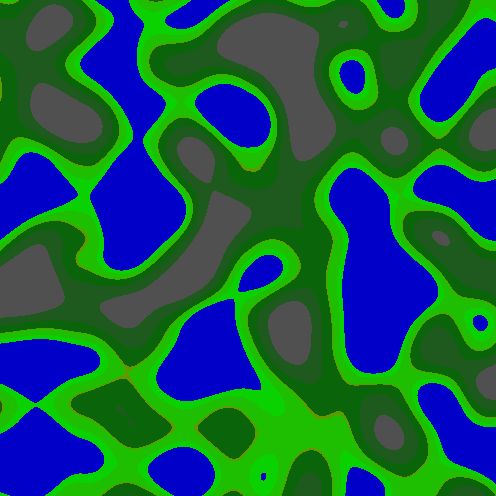
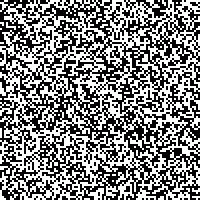

## Lesson 14: Procedural game content creation

#### Jon Macey, Ian Stephenson, Oleg Fryazinov 

- **Course:** BA Computer Animation and Visual Effects
- **Level:** 4 
- **Unit:** Procedural Content Creation

---

# Session outline

- **Title:** Procedural game content creation
- **What will you learn today:**
  - More insight about pygame library 
  - Procedural level design with Pygame

---

## Recap: Procedural content

- A procedure is the instruction or set of instructions to be executed
- Content can be anything we are presenting to the user
- In games the term is known as *Procedural Content Generation*

--

## Recap: Random numbers and random library

- Random module: *import random*
- *random.randint(a, b)*: Returns a random integer between a and b.
- *random.choice(list): Chooses a random element from a list.*

```python
import random
x = random.randint(0, 800)
y = random.randint(0, 600)
```

---	

## Types of Procedural Content Generation
- **Random Generation**: Using random values to place objects and create unpredictable layouts.
- **Noise Functions**: Using noise for organic patterns (e.g. terrain generation).
- **Cellular Automata**: Algorithms that use cells to create complex systems (used in caves or dungeons).
- **Rule-Based Systems**: Predefined rules to create structured content.

---

## Recap: Pygame

```python
#!/usr/bin/env python3
import pygame  # we will need core pygame functionality
import pygame.draw  # this module will be needed for drawing on the screen

pygame.init()  # this is an essential line to make pygame working

width = 700  # width of the game window
height = 700  # height of the game window
screen = pygame.display.set_mode((width, height))  # create the game window
clock = (
    pygame.time.Clock()
)  # use the clock to ensure we updating the window not too often
running = True  # the variable to ensure the game loop
black = (0, 0, 0)

try:
    spriteWater = pygame.image.load("base/liquidWater.png")
except FileNotFoundError:
    print("File base/liquidWater.png is not found")

# the game loop
while running:
    screen.fill(
        black
    )  # clear the window by filling the space with the background colour

    for x in range (0, 700, 70):
        for y in range (0, 700, 70):
            screen.blit(spriteWater, (x, y))

    # event management
    for event in pygame.event.get():  # if we received an event
        if event.type == pygame.QUIT:  # if the event is "quit game"
            running = False  # then we set the variable allowing for the loop to stop
    pygame.display.flip()  # render
    clock.tick(30)  # wait until we run with 30 frames per second or less
# end of the program
```

---

## Grid-based random generation

- The screen is divided into a grid
  - Normally stored as a list of lists
- Obstacles, collectibles, etc are placed randomly

--

## Grid-based random generation, example

```python
#!/usr/bin/env python3
import pygame  # we will need core pygame functionality
import pygame.draw  # this module will be needed for drawing on the screen
import random

pygame.init()  # this is an essential line to make pygame working

width = 700  # width of the game window
height = 700  # height of the game window
screen = pygame.display.set_mode((width, height))  # create the game window
clock = (
    pygame.time.Clock()
)  # use the clock to ensure we updating the window not too often
running = True  # the variable to ensure the game loop
black = (0, 0, 0)

sprites = [
    "liquidWater",
    "bridgeLogs",
]

sprite_images = []
for spriteName in sprites:
    filename = "base/" + spriteName + ".png"
    try:
        loadedImage = pygame.image.load(filename)
        sprite_images.append(loadedImage)
    except FileNotFoundError:
        print("File base/liquidWater.png is not found")

levelElements = ["water", "island"]
grid = []
for x in range (10):
    gridrow = []
    for y in range(10):
        gridrow.append(random.choice(levelElements))
    grid.append(gridrow)

# the game loop
while running:
    screen.fill(
        black
    )  # clear the window by filling the space with the background colour

    for x in range (0, 10):
        for y in range (0, 10):
            screen.blit(sprite_images[0], (x*70, y*70))
            if (grid[x][y] == "island"):
                screen.blit(sprite_images[1], (x*70, y*70))

    # event management
    for event in pygame.event.get():  # if we received an event
        if event.type == pygame.QUIT:  # if the event is "quit game"
            running = False  # then we set the variable allowing for the loop to stop
    pygame.display.flip()  # render
    clock.tick(30)  # wait until we run with 30 frames per second or less
# end of the program
```

--

## Variations in random generation

- To have some control on random generation we can introduce conditions
- For example, place a certain number of obstacles in the grid
  - Random coordinates

```python
grid = []
for x in range (10):
    gridrow = []
    for y in range(10):
        gridrow.append("water")
    grid.append(gridrow)

for i in range(10):
    posX = random.randint(0, 10)
    posY = random.randint(0, 10)
    grid[posX][posY] = "island"
```

--

## Adding larger objects

- Grid-based methods work for larger objects (prefabs) too
- You modify more than one cell

```python
grid = []
for x in range (10):
    gridrow = []
    for y in range(10):
        gridrow.append(0)
    grid.append(gridrow)

for i in range(10):
    posX = random.randint(0, 7) # 10-3 = 7
    posY = random.randint(0, 8) # 10-2 = 8
    grid[posX][posY] = 2
    grid[posX+1][posY] = 3
    grid[posX+2][posY] = 4
    grid[posX][posY+1] = 5
    grid[posX+1][posY+1] = 5
    grid[posX+2][posY+1] = 5
```

--

### Modifying the code by adding extra conditions

- While placing objects randomly we might want to check if the place is not previously occupied

```python
for i in range(10):
    posX = random.randint(0, 7) # 10-3 = 7
    posY = random.randint(0, 8) # 10-2 = 8
    if grid[posX][posY] == 0 and grid[posX+1][posY] == 0 and grid[posX+2][posY] == 0 and grid[posX][posY+1] == 0 and grid[posX+1][posY+1]==0 and grid[posX+2][posY+1]==0:
        #place the island only if the space has not been taken before
        grid[posX][posY] = 2
        grid[posX+1][posY] = 3
        grid[posX+2][posY] = 4
        grid[posX][posY+1] = 5
        grid[posX+1][posY+1] = 5
        grid[posX+2][posY+1] = 5
```

---

## Noise-based procedural generation

- Noise *functions* interpolate in grids with random values
- Classic noise functions are Perlin Noise and Simplex Noise
- Noise functions create natural patterns useful in PCG, especially for terrain.



---

## Cellular automata

- Cellular automata is a grid of cells, each in one of a finite number of states
- At each iteration, the cell can change its state based on some fixed rule based on the current state and the state of its neighbours
- Classic example is <a href = "https://en.wikipedia.org/wiki/Conway%27s_Game_of_Life">Conway's game of life</a>



---

## Rule-based systems

- Cellular automata is an example of rule-based systems
- We define the rule, we follow the rule until we hit the stopping condition

--

## Drunkard walk algorithm

- Example of rule-based system
  - Start at a random cell
  - Randomly move in one direction
  - Stop when a predefined number of steps have been taken
  

# Conclusion

- **What have you learned today**
  - 
- **Homework**
  -  

--

# Next time

- **What will you learn next time**
  - How to create games with Pygame
  - Procedural content generation for games 

--

# Q&A and discussion
- **Open Floor for Questions**

