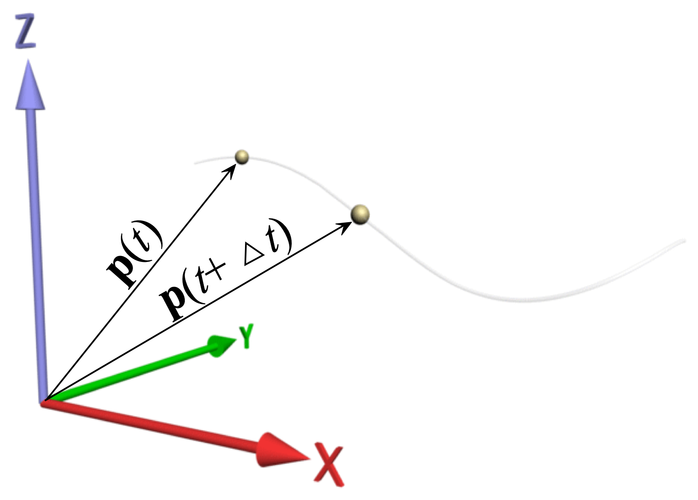
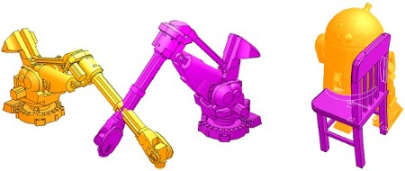

## Lesson 16: Bouncing ball class

#### Jon Macey, Ian Stephenson, Oleg Fryazinov 

- **Course:** BA Computer Animation and Visual Effects
- **Level:** 4 
- **Unit:** Procedural Content Creation

---

# Session outline

- **Title:** Bouncing ball class
- **What will you learn today:**
  - Classes in Python
  - How we can use physics to animate bouncing ball
  - How to manage projects 

---

## Recap: pygame

- What is Pygame?
  - **Pygame** is a popular Python library used to create games and interactive applications.
  - Provides tools for handling graphics, sounds, and user inputs.
- *import pygame*


---

## Preparing our project

[1_start.py](https://github.com/NCCA/PCCSlides/blob/main/Lecture16/code/1_start.py)

```python
#!/usr/bin/env python3
import pygame  # we will need core pygame functionality
import pygame.draw  # this module will be needed for drawing on the screen

pygame.init()  # this is an essential line to make pygame working

width = 640  # width of the game window
height = 480  # height of the game window
screen = pygame.display.set_mode((width, height))  # create the game window
clock = (
    pygame.time.Clock()
)  # use the clock to ensure we updating the window not too often
running = True  # the variable to ensure the game loop
white = (255, 255, 255)
black = (0, 0, 0)

# the game loop
while running:
    screen.fill(
        black
    )  # clear the window by filling the space with the background colour
    # draw two lines
    pygame.draw.circle(screen, white, (20, 20), 20)

    # event management
    for event in pygame.event.get():  # if we received an event
        if event.type == pygame.QUIT:  # if the event is "quit game"
            running = False  # then we set the variable allowing for the loop to stop
    pygame.display.flip()  # render
    clock.tick(30)  # wait until we run with 30 frames per second or less
# end of the program
```

---

## Classes in Python

- A class is a blueprint for creating objects
- Objects are instances of classes and can have attributes (data) and methods (functions)
- Why use classes?
  - **Encapsulation**: Bundle data and behavious together
  - **Reusability**: Define once, use multiple times
  - **Abstraction**: Hide complex details behind simple interfaces

--

## Defining a class

```python
class ClassName:
    def __init__(self):
        self.attribute = value
```

- *ClassName* is how we call this class
- *attribute* is one of the attributes (data) of the class

--

## Defining a class: example

```python
class BouncingBall:
    def __init__(self, radius, position, velocity):
		self.radius = radius
        self.position = position
		self.velocity = velocity
```

--

## Creating an object

- Instantiating a Class:
```python
class BouncingBall:
    def __init__(self, radius, position, velocity):
		self.radius = radius
        self.position = position
		self.velocity = velocity
#...
ball1 = BouncingBall(20, (20,20), (10,0))
ball2 = BouncingBall(20, (620,20), (-10,0))
```

--

## Accessing attributes of an object

```python
class BouncingBall:
    def __init__(self, radius, position, velocity):
		self.radius = radius
        self.position = position
		self.velocity = velocity
 #...
ball1 = BouncingBall(20, (20,20), (10,0))
ball2 = BouncingBall(20, (620,20), (-10,0))
 #...
pygame.draw.circle(screen, white, ball1.position, ball1.radius)
pygame.draw.circle(screen, white, ball2.position, ball2.radius)
```

--

## Class vs instance variable

- Instance variables: specific to an object, defined using **self**
- Class variables: shared across all objects of the class, defined outside methods

```python
class BouncingBall:
	acceleration = (0, 100)
    def __init__(self, radius, position, velocity):
		self.radius = radius
        self.position = position
		self.velocity = velocity
```


---

## Methods in classes

- **Methods**: Functions defined inside a class to manipulate or retrieve data.
  - The first argument is usually **Self** parameter
- The **__init__** method automatically called when an object is created
  - Used to initialize the attributes of the class

--

### Adding methods to the bouncing ball class

```python
class BouncingBall:
    def __init__(self, radius, position, velocity):
		self.radius = radius
        self.position = position
		self.velocity = velocity
    def draw(self, screen, colour):
        pygame.draw.circle(screen, colour, self.position, self.radius)		
```

---

## Physics in computer graphics

- When we are animating procedurally, we want to make believable animations
  - We use physics for procedural animation
- Why physics?
  - Believable and stable, based on the science
  - Allows for the interactive CG
- How?
  - Simplified Newtonian physics

--

### Physics in CG: particle kinematics

- A sphere of finite radius with a perfectly smooth frictionless surface
  - No rotational motion
- Basic properties of motion: position, velocity, acceleration
- Newton's 2nd Law of Motion: F = ma
  - Force causes acceleration, acceleration changes velocity, velocity changes position

--

## Particle movement

- $p(t+\Delta t)= p(t)+\Delta t \cdot v(t)$
- $v(t+\Delta t)= v(t)+\Delta t \cdot a(t)$
- *p* is a position vector, *v* is a velocity vector, *a* is an acceleration vector



--

## Adding a method for particle movement

```python
    def update(self, deltaT):
        oldPosition = self.position
        oldVelocity = self.velocity
        self.position = (oldPosition[0] + deltaT*oldVelocity[0], oldPosition[1] + deltaT*oldVelocity[1])
        self.velocity = (oldVelocity[0] + deltaT*self.acceleration[0], oldVelocity[1] + deltaT*self.acceleration[1])
```

---

## Collision detection

- Collision detection is a geometric intersection detection problem
- Two objects intersect if there is a point (or set of points) that is part of both objects
- In general, it is a complex problem, because geometry is complex



--

## Solving collision detection

- The problem of collision detection is colved by using very simple shapes
- For example, two spheres intersect if the distance between their centres is less than sum of their radii
- A sphere and a plane intersect is the distance to the plane is less than the radius of the sphere

--

### Adding collision detection to Bouncing Ball class

```python
class BouncingBall:
    acceleration = (0,100)
    minX = 0
    minY = 0
    maxX = 1000
    maxY = 1000;
    def __init__(self, radius, position, velocity):
        self.radius = radius
        self.position = position
        self.velocity = velocity
    def draw(self, screen, colour):
        pygame.draw.circle(screen, colour, self.position, self.radius)
    def setBounds(self, minX, minY, maxX, maxY):
        self.minX = minX + self.radius
        self.maxX = maxX - self.radius
        self.minY = minY + self.radius
        self.maxY = maxY - self.radius
    def update(self, deltaT):
        oldPosition = self.position
        oldVelocity = self.velocity
        newPosition = (oldPosition[0] + deltaT*oldVelocity[0], oldPosition[1] + deltaT*oldVelocity[1])
        newVelocity = (oldVelocity[0] + deltaT*self.acceleration[0], oldVelocity[1] + deltaT*self.acceleration[1])
        self.position = newPosition
        self.velocity = newVelocity
        if newPosition[1] < self.minY or newPosition[1] > self.maxY:
            self.position = oldPosition
            self.velocity = (newVelocity[0], -newVelocity[1])
        if self.position[0] < self.minX or self.position[0] > self.maxX:
            self.position = oldPosition
            self.velocity = (-newVelocity[0], newVelocity[1])
``` 

---

### What else in physics we can use?

- For the interaction of particles in basic Newtonian physics we also use the law of conservation of momentum
- The stationary object can "absorb" the velocity from the moving object

```python
        if newPosition[1] < self.minY or newPosition[1] > self.maxY:
            self.position = oldPosition
            self.velocity = (newVelocity[0], -newVelocity[1]*0.8)
        if self.position[0] < self.minX or self.position[0] > self.maxX:
            self.position = oldPosition
            self.velocity = (-newVelocity[0]*0.8, newVelocity[1])
```

--

### Bringing it all together 

[2_bouncingball.py](https://github.com/NCCA/PCCSlides/blob/main/Lecture16/code/2_bouncingball.py)

```python
ball1 = BouncingBall(20, (20,20), (10,0))
ball2 = BouncingBall(20, (620,20), (-100,100))
ball1.setBounds(0, 0, width, height)
ball2.setBounds(0, 0, width, height)

# the game loop
while running:
    screen.fill(
        black
    )  # clear the window by filling the space with the background colour
    # draw two lines
    deltaT = float(clock.get_time())/1000.0
    ball1.draw(screen, white)
    ball2.draw(screen, white)
    ball1.update(deltaT)
    ball2.update(deltaT)

    # event management
    for event in pygame.event.get():  # if we received an event
        if event.type == pygame.QUIT:  # if the event is "quit game"
            running = False  # then we set the variable allowing for the loop to stop
    pygame.display.flip()  # render
    clock.tick(30)  # wait until we run with 30 frames per second or less
# end of the program
```

---

## Including external files

- Why Include External Files?
  - Reuse code across multiple files or projects.
  - Keep code modular and organised.
- Key concept: Python’s import keyword allows us to include and use external Python files in the current script.

--

## Using the import Keyword

1. Import the Whole Module:
```python
import math
print(math.sqrt(16))  # Output: 4.0
```

2. Import Specific Functions:
```python
from math import sqrt
print(sqrt(16))  # Output: 4.0
```

--

## Using the import Keyword

3. Rename Module or Function:

```python
import math as m
print(m.sqrt(16))  # Output: 4.0
```

```python
from math import sqrt as square_root
print(square_root(16))  # Output: 4.0
```

--

### Creating and Importing Custom Modules

1. Create a Python file with reusable functions or classes
2. Import and use it in another file
3. Ensure Files Are in the Same Directory or PYTHONPATH.

--

## Example: bouncing ball module

[bouncingball.py](https://github.com/NCCA/PCCSlides/blob/main/Lecture16/code/bouncingball.py)

```python
import pygame
class BouncingBall:
    acceleration = (0,100)
    minX = 0
    minY = 0
    maxX = 1000
    maxY = 1000;
    def __init__(self, radius, position, velocity):
        self.radius = radius
        self.position = position
        self.velocity = velocity
    def draw(self, screen, colour):
        pygame.draw.circle(screen, colour, self.position, self.radius)
    def setBounds(self, minX, minY, maxX, maxY):
        self.minX = minX + self.radius
        self.maxX = maxX - self.radius
        self.minY = minY + self.radius
        self.maxY = maxY - self.radius
    def update(self, deltaT):
        oldPosition = self.position
        oldVelocity = self.velocity
        newPosition = (oldPosition[0] + deltaT*oldVelocity[0], oldPosition[1] + deltaT*oldVelocity[1])
        newVelocity = (oldVelocity[0] + deltaT*self.acceleration[0], oldVelocity[1] + deltaT*self.acceleration[1])
        self.position = newPosition
        self.velocity = newVelocity
        if newPosition[1] < self.minY or newPosition[1] > self.maxY:
            self.position = oldPosition
            self.velocity = (newVelocity[0], -newVelocity[1]*0.8)
        if self.position[0] < self.minX or self.position[0] > self.maxX:
            self.position = oldPosition
            self.velocity = (-newVelocity[0]*0.8, newVelocity[1])
```

--

## Example: using bouncing ball module

[3_include.py](https://github.com/NCCA/PCCSlides/blob/main/Lecture16/code/3_include.py)

```python
from bouncingball import BouncingBall as BouncingBall
```

- Best practices: 
  - Avoid circular imports.
  - Use relative imports within packages.
  - Keep module functionality focused and specific.

---

## Project management in Python

- Why Project Management in Python?
  - Helps organize and maintain codebases.
  - Encourages collaboration and productivity.
  - Reduces errors in development processes.

--

## Organising a Python Project

```css
my_project/
├── my_package/
|   |── __init__.py # Initialize package
│   ├── module1.py
│   └── module2.py
├── main.py
├── README.md
└── .gitignore
```

- *README.md*: Project overview and instructions in the Markdown format
- .gitignore: Files to exclude from version control.

--

## Importance of Source Control

- What is Source Control?
  - A system to track changes to files.
- Safeguards against data loss.
- Provides a history of changes.
- Supports branching and merging for collaborative work.

--

## Introduction to Git

- **Git** is a distributed version control system.
- Commands: 
  - *git init* : Initialize repository  
  - *git add .* : Stage changes  
  - *git commit -m "message"* : Commit changes  
  - *git push* : Push changes to remote repository  
  - *git pull* : Pull latest changes from remote repository 
  - *git status* : show the status of our repo

--

## Setting up some defaults

```
git config --global user.name "put your name here"
git config --global user.email "put your email here"
git config --global pull.rebase false
git config --global init.defaultbranch main

git config --list
```

--

## Collaboration with GitHub/GitLab

- Platforms like GitHub or GitLab facilitate collaboration.
- Collaboration Tips:
  - Commit often with clear messages.
  - regularly pull the latest changes to avoid conflicts.

---

# Conclusion

- **What have you learned today**
  - How to define classes using an example of the bouncing ball
  - Basics of CG physics
  - Foundations of project management
- **Homework**
  - The information in the last three Lessons is enough to implement the Breakout game, something for a homework?

--

# Next time

- **What will you learn next time**
  - How to generate content in Maya

--

# Q&A and discussion
- **Open Floor for Questions**

