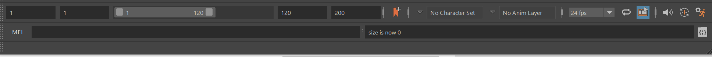
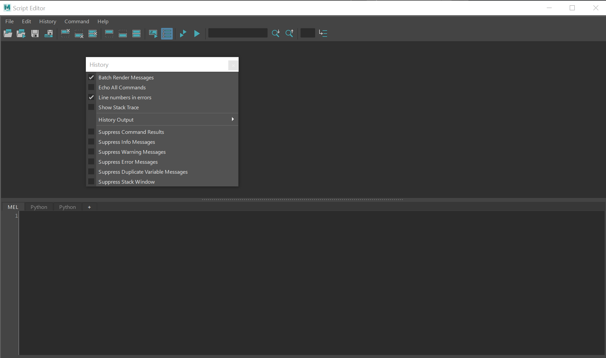
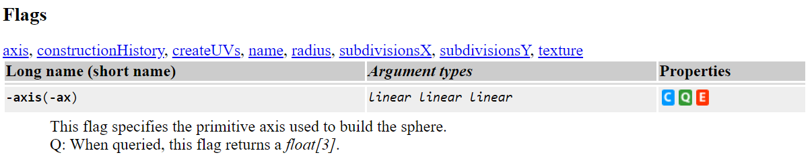

### Lesson 17: Python in  Maya

#### Jon Macey, Ian Stephenson, Oleg Fryazinov 

- **Course:** BA Computer Animation and Visual Effects
- **Level:** 4 
- **Unit:** Procedural Content Creation

---

# Session outline

- **Title:** Introduction to Python in Autodesk Maya
- **What will you learn today:**
  - How to create objects in Maya using Python
  - Procedural content creation in Maya

---

### Maya as a scripting Engine

- at it's simplest maya is a scripting engine that can run MEL language scripts.
- When maya starts up it executes multiple scripts located in the directory 

``` $MAYA_LOCATION/scripts/startup/ ```

- This makes it possible to fully customize the look and feel of maya.

--

## MEL (Maya Embedded Language)

>As a language, MEL is descended from UNIX shell scripting. This means MEL is strongly based on executing commands to accomplish things (like executing commands in a UNIX shell), rather than manipulating data structures, calling functions, or using object oriented methods as in other languages.

--

# [MEL](https://knowledge.autodesk.com/support/maya/learn-explore/caas/CloudHelp/cloudhelp/2018/ENU/Maya-Scripting/files/GUID-60178D44-9990-45B4-8B43-9429D54DF70E-htm.html)

- Maya’s user interface is created primarily using MEL, and MEL provides an easy way to extend the functionality of Maya. 
- Everything you can do using Maya’s graphical interface can be automated and extended using MEL. 
- Familiarity with MEL can deepen your understanding of and expertise with Maya.
- it’s easy to perform a task in the graphical interface, then drag the resulting commands from the Script Editor to the shelf to create a button. 

--

# Do I need MEL?

- Mel is still the low level core of maya, as a power user (TD) it can be useful to know how to write mel scripts.
- However, for most users it is better to use Python as it is a more modern language and is more widely used in the industry.
- maya.cmds is a python module that wraps the mel commands so you can use them in python.
  - because of this the way we interact with maya is very similar in both languages.

---


## The script editor



- The script editor can be launched by pressing the icon at the bottom right of the screen.
- simple mel commands can also be executed in the mel dialog to the left.

--

## The script editor



--

## The script editor

- The script editor has two tabs at the bottom, these allow us to switch between mel and python.
- We can also load in files to edit and run.
- Feedback is provided in the output window above the script editor.

---

## a simple commands

- **Create a sphere:**

```python
cmds.polySphere()
```

- This will create a simple polysphere at the origin there are some things to note
  - it has a default name of pSphere1
  - it is selected by default
  - The command returns the name of the object created.

```
# Result: ['pSphere1', 'polySphere1']
```


--

### Create, edit, and query modes

- many of the commands have different modes outlined in the documentation.



- by default the command is in create mode, but we can also query and edit the object.

--

## Query mode

- Query the radius of the sphere:

```python
radius=cmds.polySphere(q=True, r=True)
print(radius)
```

- What happens if the object is not selected?
- Always best to name the object we want to query.

```
radius=cmds.polySphere('pSphere1', q=True, r=True)
print(radius)
```

--

## Edit mode

- Edit the radius of the sphere:

```python
cmds.polySphere('pSphere1', e=True, r=2)
```

- In this case we are naming the object and editing the radius, however if selected this would affect the selected object.

--

## edit and query mode

- we can only edit / query one attribute at a time
- if we need to change more than one object we need to do them individually.

```python
cmds.polySphere('pSphere1', e=True, r=2)
cmds.polySphere('pSphere1', e=True, sx=10)
cmds.polySphere('pSphere1', e=True, sy=10)
```

---


