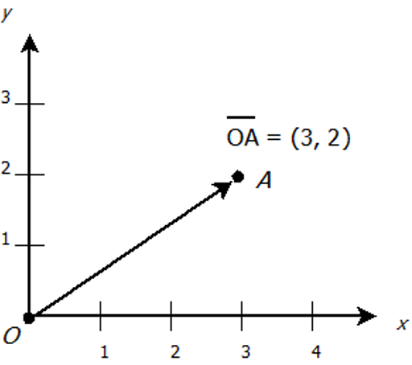
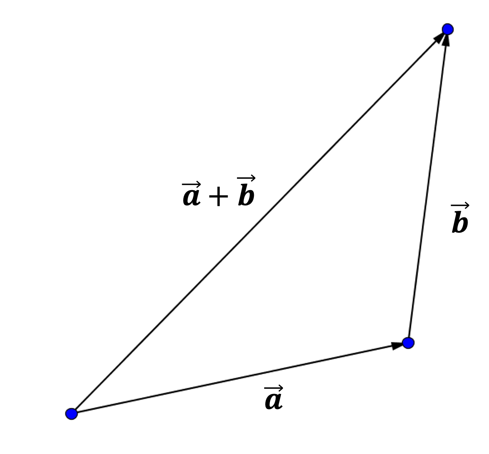

## Lesson 7: Vector and lines

#### Jon Macey, Ian Stephenson, Oleg Fryazinov 

- **Course:** BA Computer Animation and Visual Effects
- **Level:** 4 
- **Unit:** Procedural Content Creation

---

# Session outline

- **Title:** Vector and lines
- **What will you learn today:**
  - What is a vector
  - Why we need to know vectors to draw lines

---

## Recap: functions

- A **function** is a reusable block of code that performs a specific task.
- Parameters are variables that a function uses as input. When calling a function, arguments are passed to these parameters.

```python
def add_numbers(a, b):
    return a + b

print(add_numbers(3, 5))  # Output: 8
```

--

## Recap: loops

- The for loop iterates over a sequence (such as a list, tuple, string, or range)
- range() generates a sequence of numbers, commonly used with for loops

```python
for i in range(5):
    print(i)
```

--

## Recap: data types

- Python has 5 standard data types
  1. **Numbers**: 1, 0.5, -3.14
  2. **String**: "Hello, students"
  3. **List**: ["animation", "effects", "games", "animation"]
  4. Tuple
  5. Dictionary

---

## Tuples

- Python **tuple** is a collection of objects separated by commas.
- It is similar to lists, but not the same!
```python
var = ("Computer", "Animation", "Visual", "Effects")
print(var)
```

--

## Tuple with one item

- In case your generating a tuple with a single element, make sure to add a comma after the element. 

```python
#One-item tuple
mytuple = ("Animation",)
print(type(mytuple))
 
#NOT a tuple
mytuple = ("Animation")
print(type(mytuple))
```

--

## Tuple vs List

- Tuples are **ordered** and **immutable**
  - You cannot add items to a tuple once it is created.
  - You can only read elements, not change them
  - You cannot remove items from tuple once it is created.
  
```python
var = ("Computer", "Animation", "Visual", "Effects")
print(var[1]) # prints Animation
var[1]="Graphics" # generates error
```

--

## Accessing values in tuples

- There are two ways to access the elements of a tuple: 
  - Using a positive index
  - Using a negative index

```python
var = ("Computer", "Animation", "Visual", "Effects")
print("Value in Var[0] = ", var[0])
print("Value in Var[1] = ", var[1])
print("Value in Var[1] = ", var[2])
print("Value in Var[2] = ", var[3])
print("Value in Var[-1] = ", var[-1])
print("Value in Var[-2] = ", var[-2])
print("Value in Var[-3] = ", var[-3])
print("Value in Var[-3] = ", var[-4])
```

---

## Tuples in graphics

```python
from PIL import Image, ImageDraw
image = Image.new("RGB", (640, 480), (100, 0, 20))
canvas = ImageDraw.Draw(image)
canvas.line(((100, 100), (250, 50)), (0, 255, 255))
image.show()
```

- We already used tuples: image resolution, colours, coordinates

---

# Vectors

- Did you have vectors at school?

<iframe width="100%" height="800" src="https://immersivemath.com/ila/ch02_vectors/ch02.html#fig_vec_breakout"></iframe>

--

## Vector: a definition

- A **vector** is a quantity that has length and direction
- A geometric vector is defined by a directed line segment


--

## Vector: properties

- A **vector** is a quantity that has length and direction
  - Vectors are not defined by starting position
  - Vectors are essentially displacements
- Vectors with the same direction are parallel line segments

--

## Position vs direction

- A point defines the location
  - Defined by coordinates
- A vector defines the direction
  - For example, direction from the origin to another point



--

## Position vs direction

- You cannot do mathematical operations such as addition over two points, but you can over vectors
- To define the vector you need two points


--

## Algebraic and geometric vectors

- We are going to work with vectors in two ways
  - Geometric vectors: a directed line segment
  - Algebraic vectors: a tuple of scalar numbers

---

## Vector: an algebraic definition

- Let *A* and *B* be two points with coordinates $ (a_x, a_y) $ and $ (b_x, b_y) $
- We denote the vector from *A* to *B* as $ \overrightarrow{AB} $
- Its values are $ (b_x-a_x, b_y-a_y) $
  - Note we are doing subtractions per coordinate (vector component)

--

## Length of the vector

- The length of the directed line segment *AB* is the distance between *A* and *B*
- We denote it as $ \left\| \overrightarrow{AB} \right\| $
- The value is $ \sqrt{(b_x-a_x)^2+(b_y-a_y)^2} $

---

## Visualising vectors

- A geometric vector is defined by a directed line segment

<iframe width="640" height="360" frameborder="0" src="https://www.shadertoy.com/embed/l32yzd?gui=true&t=10&paused=true&muted=false" allowfullscreen></iframe>

--

## Visualising vectors with Python

- vector = endpoint - startpoint 
- endpoint = startpoint + vector
  - for the line segment we call this vector **a direction vector**

```python
from PIL import Image, ImageDraw
def draw_segment(canvas, start, direction, colour) -> None:
    canvas.line(((start[0], start[1]), (start[0] + direction[0], start[1]+direction[1])), colour)

image = Image.new("RGB", (640, 480), (100, 0, 20))
canvas = ImageDraw.Draw(image)
draw_segment(canvas, (100, 50), (-100, 50), (255, 255, 0))
image.show()
```

--

## Position vs direction

[lines1.py](https://github.com/NCCA/PCCSlides/blob/main/Lecture7/code/lines1.py)

```python
def draw_segment(canvas, start, direction, colour) -> None:
    canvas.line(((start[0], start[1]), (start[0] + direction[0], start[1]+direction[1])), colour)
```

- **start** is a position (location)
- *direction** is a vector (displacement)
- Both represented by the same data structure: **a tuple**

--

## Equal vectors

- If two vectors are equal, their components are equal as well
- Vectors with the same values are parallel line segments of the same length

```python
from PIL import Image, ImageDraw
def draw_segment(canvas, start, direction, colour) -> None:
    canvas.line(((start[0], start[1]), (start[0] + direction[0], start[1]+direction[1])), colour)

image = Image.new("RGB", (640, 480), (100, 0, 20))
canvas = ImageDraw.Draw(image)
draw_segment(canvas, (100, 50), (-100, 50), (255, 255, 0))
draw_segment(canvas, (150, 70), (-100, 50), (255, 255, 0))
draw_segment(canvas, (200, 70), (-100, 50), (255, 255, 0))
image.show()
```

---

## Vector operations

- You cannot do mathematical operations over two points, but you can over vectors
- Most of these operations are defined with vector algebra and have geometrical meaning
- Example: equal vectors
  - Algebraic meaning: their components are equal
  - Geometric meaning: they are represented by parallel line segments

--

## Vector addition

- Algebra: $ (a_x, a_y) + (b_x, b_y) = (a_x+b_x, a_y+b_y)$
- Geometry: 
  - <small>Position the vectors **a** and **b** so that the start point of **b** coincides with the end point of **a**
  - Then start point of **a+b** coincides with the start point of **a** and end point of **a+b** coincides with the start point of **b**</small>



--

## Vector addition: Python example

```python
from PIL import Image, ImageDraw
def draw_segment(canvas, start, direction, colour) -> None:
    canvas.line(((start[0], start[1]), (start[0] + direction[0], start[1]+direction[1])), colour)

image = Image.new("RGB", (640, 480), (100, 0, 20))
canvas = ImageDraw.Draw(image)
vec_a = (20, 30)
vec_b = (-50, 20)
vec_a_plus_b = (vec_a[0]+vec_b[0],vec_a[1]+vec_b[1])
start_a = (100,50)
start_b = (start_a[0]+vec_a[0], start_a[1]+vec_a[1])
draw_segment(canvas, start_a, vec_a, (0, 255, 255))
draw_segment(canvas, start_b, vec_b, (0, 255, 0))
draw_segment(canvas, start_a, vec_a_plus_b, (255, 255, 0))
image.show()
```

--

### Vector multiplication by a scalar

- Algebra: $ p\cdot(a_x, a_y) = (p \cdot a_x, p \cdot a_y)$
- Geometry: 
  - The length of $p \mathbf{a}$ is *p* times the length of $\mathbf{a}$
  - If $p>0$, the direction is the same, if $p<0$, the direction is opposite
  


--

### Vector multiplication by a scalar: Python example

```python
from PIL import Image, ImageDraw
def draw_segment(canvas, start, direction, colour) -> None:
    canvas.line(((start[0], start[1]), (start[0] + direction[0], start[1]+direction[1])), colour)

image = Image.new("RGB", (640, 480), (100, 0, 20))
canvas = ImageDraw.Draw(image)
vec_a = (20, 30)
start_a = (100,50)
start_b = (150,100)
start_c = (200,150)
draw_segment(canvas, start_a, vec_a, (0, 255, 255))
draw_segment(canvas, start_b, (vec_a[0]*2, vec_a[1]*2), (0, 255, 0))
draw_segment(canvas, start_c, (vec_a[0]*(-0.5), vec_a[1]*(-0.5)), (255, 255, 0))
image.show()
```

--

## Vector inversion

- Multiplication by -1 results in vector inversion
- **a** and **-a** have the same magnitude and opposite direction
- $ -(a_x, a_y) = (-a_x, -a_y)$


--

## Vector subtraction

- **a** - **b** = **a + ( **-b** )
- $ (a_x, a_y) - (b_x, b_y) = (a_x-b_x, a_y-b_y) $


---

## Vectors on a triangle

- How many vectors can be defined with three distinctive non-collinear points? 


--

## Vectors on a triangle

- How many vectors can be defined with three distinctive non-collinear points? 
  - Six!


--

## Vectors on a triangle

- If we define two vectors that do not share the same line segment, the rest four can be expressed with vector addition, subtraction and inverse.
- If we have $ \overrightarrow{AB} $ and $ \overrightarrow{AC} $, then 
  - <small>$ \overrightarrow{BA} = -\overrightarrow{AB} $  $ \overrightarrow{CA} = -\overrightarrow{AC} $  $ \overrightarrow{BC} = \overrightarrow{AC}-\overrightarrow{AB} $   $ \overrightarrow{CB} = \overrightarrow{AB}-\overrightarrow{AC} $</small>


---

## The length of the vector

- For the vector $ \overrightarrow{AB} $ the length (the magnitude) is represented by the symbol $ ||\overrightarrow{AB}|| $


- $ ||(a_x,a_y)|| = \sqrt{a_x^2+ a_y^2} $

--

## Normalisation

- A vector whose length is equal to 1 is called **unit vector**
- If we multiply any vector by inverse of its length, we get a unit vector with the same direction
- Example: $ \vec{a} = (3,4)$, $ ||\vec{a}|| $ = $\sqrt{3^2+4^2}=5 $, $\vec{a_n} = (\frac{3}{5},\frac{4}{5})$

--

## Why normalisation?

- Normalisation simplifies some operations
  - We will be talking later about it
- You have the control on the length: to get the vector with the given direction and length, you start with the unit vector and the given direction and multiply it by the length

---

## Putting it all together

```python
from PIL import Image, ImageDraw
def draw_segment(canvas, start, direction, colour) -> None:
    canvas.line(((start[0], start[1]), (start[0] + direction[0], start[1]+direction[1])), colour)

image = Image.new("RGB", (640, 480), (100, 0, 20))
canvas = ImageDraw.Draw(image)
start_point = (200,200)
for i in range(1, 10):
    x = random()
    y = random()
    x_n = x/math.sqrt(x*x+y*y)
    y_n = y/math.sqrt(x*x+y*y)
    x = x_n*100
    y = y_n*100
    draw_segment(canvas, start_point, (x,y), (255, 255, 0))
image.show()
```

--

## Explanation

- We draw 10 random lines
- They all start in (0,0)
  - Why?
- They all have the same length of 100 pixels
- Why they are end up in positive quarter for x and y?

-- 

## Refining the code

```python
from PIL import Image, ImageDraw
def draw_segment(canvas, start, direction, colour) -> None:
    canvas.line(((start[0], start[1]), (start[0] + direction[0], start[1]+direction[1])), colour)

image = Image.new("RGB", (640, 480), (100, 0, 20))
canvas = ImageDraw.Draw(image)
start_point = (200,200)
for i in range(1, 100):
    x = random.uniform(-1,1)
    y = random.uniform(-1,1)
    x_n = x/math.sqrt(x*x+y*y)
    y_n = y/math.sqrt(x*x+y*y)
    x = x_n*100
    y = y_n*100
    draw_segment(canvas, start_point, (x,y), (255, 255, 0))
image.show()
```

---

# Conclusion

- **What have you learned today**
  - The tuple data type
  - The vector algebra and geometry
- **Homework**
  - Modify the code such that we have not line segments, but polylines going out of a particular point 

--

# Next time

- **What will you learn next time**
  - We will be revisiting more maths from the school and apply it for our image generation

--

# Q&A and discussion
- **Open Floor for Questions**
