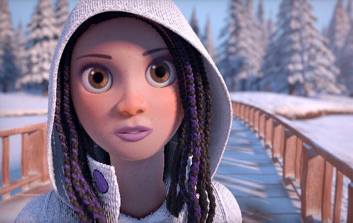

## Lesson 8: Math(s)

#### Jon Macey, Ian Stephenson, Oleg Fryazinov 

- **Course:** BA Computer Animation and Visual Effects
- **Level:** 4 
- **Unit:** Procedural Content Creation

---

# Session outline

- **Title:** Math(s)
- **What will you learn today:**
  - We will recap some maths from school
  - How these concepts are implemented in Python
  - How we can use mathematics for computer graphics

---

## Recap: functions

- A **function** is a reusable block of code that performs a specific task.
- Parameters are variables that a function uses as input. When calling a function, arguments are passed to these parameters.

```python
def add_numbers(a, b):
    return a + b

print(add_numbers(3, 5))  # Output: 8
```

--

## Recap: for loop

- range() generates a sequence of numbers, commonly used with for loops
  - start: starting number (default is 0)
  - stop: stopping point (not included)
  - step: step size (default is 1)

```python
for i in range(0, 100, 4)
    print(i);
```

--

## Recap: Python libraries

- We use **import** keyword for importing the library
- We let Python know we are using the code from the library
- Import turtle graphics: 
```python
import turtle 
```

---

## Why Maths?

<blockquote><small><p>To make a film, we have to direct almost 200 billion pixels. That's a lot of mathematics. (Iñigo Quilez, Pixar)</p></small></blockquote>					

- The image above is generated procedurally

--

## Why Maths?
- Many problems to solve in computer graphics are mathematical problems
- We are solving them using *mathematical algorithms*

---

## Power of two

- A power of two is a number of the form $2^n$ where *n* is an integer
- 1, 2, 4, 8, 16, 32, 64, 128, 256, 512, 1024, 2048, 4096...
- Texture resolution is usually powers of two
  - Square textures: 512x512, 1024x1024 (1k), 2048x2048 (2k), 4096x4096 (4k)

--

## Creating square texture

```python
from PIL import Image, ImageDraw
 #the image will be resolution x resolution
resolution = 1024 #1k image 
background_colour = (0,0,0)

image = Image.new("RGB", (resolution, resolution), background_colour)
image.show()
```

--

#### Adding content to the square texture

```python
#!/usr/bin/env python3
#texture1.py

from PIL import Image, ImageDraw

resolution = 1024 #1k image, i.e. 1024x1024 
background_colour = (0,0,0) #black background
line_colour = (255, 255, 155) #white line colour

image = Image.new("RGB", (resolution, resolution), background_colour)
canvas = ImageDraw.Draw(image)

canvas.line(((0, 0), (100, 100)), (255, 255, 0))
canvas.line(((0, 100), (100, 0)), (255, 255, 0))

image.show()
```

--

### Why square textures are useful?

- You can divide the power of two to other powers of two
- For example, we can easily create tessellations by repeating the element power-of-two times
  - Let 1024 (power of two) will be the resolution of the texture
  - Let we repeat an element 8 (power of two) times
  - The size of each element will be $1024/8 = 128$

---

## Tessellation

- A tessellation is when we cover the surface with a pattern so that there are no overlaps or gaps
- Regular tessellations is when we repeat the same geometry multiple times
- The geometry we repeat is called *tile* and the tessellation is also called *tiling*

--

## Tessellated textures

```python
# texture2_1.py
from PIL import Image, ImageDraw

resolution = 1024 #1k image, i.e. 1024x1024 
background_colour = (0,0,0) #black background
line_colour = (255, 255, 155) #white line colour
step = 100

image = Image.new("RGB", (resolution, resolution), background_colour)
canvas = ImageDraw.Draw(image)

for x in range(0, resolution, step):
	canvas.line(((x, 0), (x+100, 100)), (255, 255, 0))
	canvas.line(((x, 100), (x+100, 0)), (255, 255, 0))

image.show()
```

--

#### Tessellated textures - using power of two

```python
# texture2_2.py
from PIL import Image, ImageDraw

resolution = 1024 #1k image, i.e. 1024x1024 
background_colour = (0,0,0) #black background
line_colour = (255, 255, 155) #white line colour
step = 128

image = Image.new("RGB", (resolution, resolution), background_colour)
canvas = ImageDraw.Draw(image)

for x in range(0, resolution, step):
	canvas.line(((x, 0), (x+step, step)), (255, 255, 0))
	canvas.line(((x, step), (x+step, 0)), (255, 255, 0))

image.show()
```

--

#### Tessellated textures - using power of two

```python
from PIL import Image, ImageDraw
# texture2_3.py
resolution = 1024 #1k image, i.e. 1024x1024 
background_colour = (0,0,0) #black background
line_colour = (255, 255, 155) #white line colour
step = 128

image = Image.new("RGB", (resolution, resolution), background_colour)
canvas = ImageDraw.Draw(image)

for x in range(0, resolution, step):
	for y in range(0, resolution, step):
		canvas.line(((x, y), (x+step, y+step)), (255, 255, 0))
		canvas.line(((x, y+step), (x+step, y)), (255, 255, 0))

image.show()
```

--

#### Tessellated textures - isolating tiles

```python
# texture2_4.py
from PIL import Image, ImageDraw

def draw_square_tile(canvas, x, y, size, colour) -> None:
	canvas.line(((x, y), (x+size, y+size)), colour)
	canvas.line(((x, y+size), (x+size, y)), colour)

resolution = 1024 #1k image, i.e. 1024x1024 
background_colour = (0,0,0) #black background
line_colour = (255, 255, 155) #white line colour
step = 128

image = Image.new("RGB", (resolution, resolution), background_colour)
canvas = ImageDraw.Draw(image)

for x in range(0, resolution, step):
	for y in range(0, resolution, step):
		draw_square_tile(canvas, x, y, step, line_colour)

image.show()
```

--

#### Tessellated textures - playing with tiles

```python
# texture2_5.py
from PIL import Image, ImageDraw

def draw_square_tile(canvas, x, y, size, colour) -> None:
	canvas.line(((x, y), (x+size, y)), colour)
	canvas.line(((x+size, y), (x+size/2, y+size)), colour)
	canvas.line(((x+size/2, y+size), (x, y)), colour)

resolution = 1024 #1k image, i.e. 1024x1024 
background_colour = (0,0,0) #black background
line_colour = (255, 255, 155) #white line colour
step = 128

image = Image.new("RGB", (resolution, resolution), background_colour)
canvas = ImageDraw.Draw(image)

for x in range(0, resolution, step):
	for y in range(0, resolution, step):
		draw_square_tile(canvas, x, y, step, line_colour)

image.show()
```

---

## Interpolation

- Interpolation is a mathematical method used to estimate values between two known data points
- We will be working with linear interpolation
  - The process assumes a linear relationship

--

### Linear interpolation formula

- Given two values $x_0$ and $x_1$, and a fraction $t$ between 0 and 1: 
  - $x = x_0 + t(x_1 - x_0)$
- $t$ represents how far along the line you are (e.g. $t=0.5$ finds the middle point)
- Example: interpolating between $x_0=2$ and $x_1=8$ with $t=0.5$ gives $x=5$.

--

##### Filling a triangle with linear interpolation

- Earlier we defined the triangle like that:
```python
def draw_square_tile(canvas, x, y, size, colour) -> None:
	canvas.line(((x, y), (x+size, y)), colour)
	canvas.line(((x+size, y), (x+size/2, y+size)), colour)
	canvas.line(((x+size/2, y+size), (x, y)), colour)
```

- How we can fill out this triangle?
  - We can use various methods including linear interpolation 

--

##### Filling a triangle with linear interpolation

- The idea is: 
  - Instead of three edges, we will be drawing parallel lines one pixel apart
  - Y-direction might be a good choice for it
  - $y_{min} = y$, corresponds to t=0
  - $y_{max} = y+size$, corresponds to t=1
- $t = \frac{y_{current}-y}{size}$
  - You can check by substituting $y$ or $y-size$ instead of $y_{current}$

--

##### Filling a triangle with linear interpolation

- Start of the scanline line segment:
  - $x_0 = x$, $x_1 = x+size/2$
  - $x_s = x_0 + t(x_1 - x_0) = x + t*size$
- End of the scanline line segment: 
  - $x_0 = x+size$, $x_1 = x+size/2$
  - $x_e = x_0 + t(x_1 - x_0) = x + size + t(-size/2)$

```python
def draw_square_tile(canvas, x, y, size, colour) -> None:
	for height in range(y, y+size, 1):
		t = (height-y)/size;
		canvas.line(((x + t*size/2, y+t*size), (x+size-t*size/2, y+t*size)), colour)
```

--


### Interpolating colour

- In the previous example we interpolated geometry
- Can we interpolate colour?
  - Yes, but before look at another Python library

---

### Math library

- *math* library provides access to the mathematical functions
- Can work only with floating point real numbers and integers
  - Cannot work with complex numbers, they have *cmath* library

```python
import math
```

---

## Rounding numbers

- **floor**: returns the floor of *x*, the largest integer less than or equal to x.
- **ceil**: returns the ceiling of *x*, the smallest integer greater than or equal to *x*
- Why we use these functions?
  - colour_r = colour1[0]+t*(colour2[0]-colour1[0]) returns float
  - PIL library takes integers for colour values, so we need to convert

--

### Interpolating numbers with math.floor

```python
colour_r = math.floor(colour1[0]+t*(colour2[0]-colour1[0]))
colour_g = math.floor(colour1[1]+t*(colour2[1]-colour1[1]))
colour_b = math.floor(colour1[2]+t*(colour2[2]-colour1[2]))
```

--

#### Filling the triangle with interpolation

- Full example: 

```python
#!/usr/bin/env python3

# texture3_2.py
from PIL import Image, ImageDraw
import math


def draw_square_tile(canvas, x, y, size, colour1, colour2) -> None:
    for height in range(y, y + size, 1):
        t = (height - y) / size
        colour_r = math.floor(colour1[0] + t * (colour2[0] - colour1[0]))
        colour_g = math.floor(colour1[1] + t * (colour2[1] - colour1[1]))
        colour_b = math.floor(colour1[2] + t * (colour2[2] - colour1[2]))
        colour = (colour_r, colour_g, colour_b)
        canvas.line(
            ((x + t * size / 2, y + t * size), (x + size - t * size / 2, y + t * size)),
            colour,
        )


resolution = 1024  # 1k image, i.e. 1024x1024
background_colour = (0, 0, 0)  # black background
line_colour_1 = (255, 0, 0)  # red colour
line_colour_2 = (0, 255, 0)  # green colour
step = 128

image = Image.new("RGB", (resolution, resolution), background_colour)
canvas = ImageDraw.Draw(image)

draw_square_tile(canvas, 0, 0, step, line_colour_1, line_colour_2)

image.show()

```


---

## Trigonometric functions

- Common trigonometric functions:
  - **Sine**: math.sin(x) – Calculates the sine of an angle in radians
  - **Cosine**: math.cos(x) – Calculates the cosine of an angle in radians.
  - **Tangent**: math.tan(x) – Calculates the tangent of an angle in radians.
  - math.pi is a number PI (3.14159...)

```python
angle = math.radians(45)  # Convert 45 degrees to radians
print(math.sin(angle))  # Output: 0.7071
print(math.cos(angle))  # Output: 0.7071
print(math.tan(angle))
```

--

## Defining a circle

- Points on a circle with the centre at the origin and raduis R can be found as:
  - x = Rcos(t), y = Rsin(t), where 0 <= t <= 2*math.pi

```python
def draw_circle(cx, cy, r, col):
    dr = 5
    drRad = dr / 360.0 * 2 * math.pi
    for theta in range(0, 360, dr):
        thetaRad = (theta / 360.0) * (2 * math.pi)
        x1 = cx + r * math.cos(thetaRad)
        y1 = cy + r * math.sin(thetaRad)
        x2 = cx + r * math.cos(thetaRad + drRad)
        y2 = cy + r * math.sin(thetaRad + drRad)
        draw.line(((x1, y1), (x2, y2)), col)
```

---

#### Putting everything together and time to play

```python
#!/usr/bin/env python3
# texture4.py
from PIL import Image, ImageDraw
import math


def draw_square_tile(canvas, x, y, size, colour1, colour2) -> None:
    for height in range(y, y + size, 1):
        t = (height - y) / size
        colour_r = math.floor(colour1[0] + t * (colour2[0] - colour1[0]))
        colour_g = math.floor(colour1[1] + t * (colour2[1] - colour1[1]))
        colour_b = math.floor(colour1[2] + t * (colour2[2] - colour1[2]))
        colour = (colour_r, colour_g, colour_b)
        canvas.line(
            ((x + t * size / 2, y + t * size), (x + size - t * size / 2, y + t * size)),
            colour,
        )


def draw_circle(canvas, cx, cy, r, col) -> None:
    dr = 5
    drRad = dr / 360.0 * 2 * math.pi
    for theta in range(0, 360, dr):
        thetaRad = (theta / 360.0) * (2 * math.pi)
        x1 = cx + r * math.cos(thetaRad)
        y1 = cy + r * math.sin(thetaRad)
        x2 = cx + r * math.cos(thetaRad + drRad)
        y2 = cy + r * math.sin(thetaRad + drRad)
        canvas.line(((x1, y1), (x2, y2)), col)


resolution = 1024  # 1k image, i.e. 1024x1024
background_colour = (0, 0, 0)  # black background
line_colour_1 = (255, 0, 0)  # red colour
line_colour_2 = (0, 255, 0)  # green colour
circle_colour = (255, 255, 255)  # blue colour
step = 128

image = Image.new("RGB", (resolution, resolution), background_colour)
canvas = ImageDraw.Draw(image)

for x in range(0, resolution, step):
    for y in range(0, resolution, step):
        draw_square_tile(canvas, x, y, step, line_colour_1, line_colour_2)
        draw_circle(canvas, x + step / 2, y + step / 2, step / 2, circle_colour)

image.show()

```

---

# Conclusion

- **What have you learned today**
  - Why powers or two are important
  - Revisited / learned about a linear interpolation
  - Python *math* library
- **Homework**
  - Can you modify the code such that the colour interpolates not vertically but horizontally?

--

# Next time

- **What will you learn next time**
  - Polar coordinate system
  - Deeper dive into colours

--

# Q&A and discussion
- **Open Floor for Questions**
