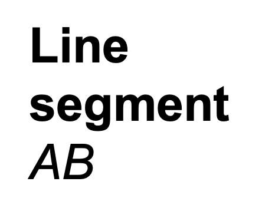

## Lesson 9: Texture maps, colour spaces

#### Jon Macey, Ian Stephenson, Oleg Fryazinov 

- **Course:** BA Computer Animation and Visual Effects
- **Level:** 4 
- **Unit:** Procedural Content Creation

---

# Session outline

- **Title:** Texture maps, colour spaces
- **What will you learn today:**
  - What is a texture map 
  - How to generate normal map using the code
  - More details about colour spaces
  - How to load and save files in Python

---

## Recap: Vectors

- A **vector** is a quantity that has length and direction
- A geometric vector is defined by a directed line segment





--

## Recap: Normalisation

- A vector whose length is equal to 1 is called **unit vector**
- If we multiply any vector by inverse of its length, we get a unit vector with the same direction
- Example: $ \vec{a} = (3,4)$, $ ||\vec{a}|| $ = $\sqrt{3^2+4^2}=5 $, $\vec{a_n} = (\frac{3}{5},\frac{4}{5})$

--

## Recap: Python libraries

- We use **import** keyword for importing the library
- We let Python know we are using the code from the library
- Import turtle graphics: 
```python
import turtle 
```

---

## goScripts 

- Most of you are used to just doing a double click to run software
- Under Linux things are a little different hence the need for extra scripts
  - **goMaya** runs Maya
  - goBlender runs Blender
  - goNuke, goHoudini, goToonz...
- The **&** makes the command run in the background: **goMaya&**

---

## File I/O

- What is File I/O?
  - File I/O (Input/Output) refers to the process of reading from and writing data to files.
  - Used for data storage, configuration management, logging, etc.
- Python’s Approach to File I/O:
  - Python provides built-in functions to easily handle files.
  - Common operations: open, read, write, and close.

--

## Opening and closing files in Python
- Opening a File:
  - Use *open()* function to open files.
  - Syntax: open(filename, mode)
  - Modes:
    - "r": Read (default)
    - "w": Write (overwrites existing file)
    - "a": Append (adds to end of file)
  - Use *close()* to close the opened file

--

### Example: opening files in Python

```python
file = open("example.txt", "r")  # Open file in read mode
# Perform operations
file.close()  # Close file after use
```

- Best Practice: Always close files after opening to free resources.

--

## File I/O Best Practices
- Using *with* Statement:
  - Why? Ensures file is properly closed after operations, even if errors occur.
  - **Syntax**: with open(filename, mode) as file:
```python
with open("example.txt", "r") as file:
    # Perform operations
```

--

## Reading from a file in Python

- Methods for Reading:
  - *file.read()*: Reads entire file as a single string.
  - *file.readline()*: Reads a single line from the file.
  - *file.readlines()*: Reads all lines and returns them as a list.
```python
with open("example.obj", "r") as file:
    content = file.read()  # Reads entire file
    print(content)  
```

--
## Writing to a file in Python
- Methods for Writing:
  - file.write(string): Writes a string to the file.
  - file.writelines(list_of_strings): Writes a list of strings to the file.
- Note: Using "w" mode overwrites existing content, while "a" mode appends to the file.

```python
with open("output.txt", "w") as file:
    file.write("Hello, world!")  # Writes "Hello, world!" to the file
```

---

## Open image in PIL

- To open an image in PIL use .open() method

```python
from PIL import Image

im = Image.open("green.jpg")
im.show()
```

--

## Save image in PIL

- After you worked on an image, do some image processing or image manipulation you will likely want to save this new version of your image.
- Saving an image can be achieved by using .save() method with PIL library’s Image module in Python.

```python
from PIL import Image

im = Image.open("green.jpg")
im.save("green_new.jpg")
```

---

## Texture maps
- A texture map is a way of applying properties to a 3d model so as to alter its appearance using 2d images.
  - This can include its color, fine detail, how shiny or metallic it looks, whether its transparent or if it glows.
- Texture maps are applied to a 2d representation of a 3d model also known as a **UV**.

--

## Physically-based Rendering pipeline
- PBR also known as Physically Based Rendering is a texture workflow that aims to simulate how light reacts with a model to attempt to simulate real life materials.
- The Physically Based Rendering (PBR) pipeline standardizes ways of texturing
- Two different types of methodologies used which require different maps
  - *Metallic Roughness*: Base colour, Metallic, Roughness
  - *Specular Glossiness*: Diffuse, Specular, Glossiness

--
## Groups of texture maps
- **Geometry Altering Maps**: maps that have the ability to alter fine details of a model’s geometry
  - Bump map, normal map, displacement map
- **PBR rendering maps**: maps that simulate real-life materials
  - Base colour map, metallic map, roughness map
- Additional maps
  - Opacity map, emissive colour

---

## Create the base colour map

```python
#!/usr/bin/env python3
# texture1.py
from PIL import Image, ImageDraw
import math

def drawCircle(canvas, cx, cy, radius, colour, thickness) -> None:
    dr = 5
    drRad = dr / 360.0 * 2 * math.pi
    for theta in range(0, 360, dr):
        thetaRad = (theta / 360.0) * (2 * math.pi)
        x1 = cx + radius * math.cos(thetaRad)
        y1 = cy + radius * math.sin(thetaRad)
        x2 = cx + radius * math.cos(thetaRad + drRad)
        y2 = cy + radius * math.sin(thetaRad + drRad)
        canvas.line(((x1, y1), (x2, y2)), colour, thickness)


resolution = 1024  # 1k image, i.e. 1024x1024
backgroundColour = (0, 0, 0)  # black background
circleColour = (255, 0, 0)  # red colour
step = 128
lineThickness = 10

image = Image.new("RGB", (resolution, resolution), backgroundColour)
canvas = ImageDraw.Draw(image)

for x in range(0, resolution, step):
    for y in range(0, resolution, step):
        drawCircle(canvas, x + step / 2, y + step / 2, step / 2, circleColour, lineThickness)

image.show()

```

--

## Save the base colour map

```python
#!/usr/bin/env python3
# texture2.py
from PIL import Image, ImageDraw
import math

def drawCircle(canvas, cx, cy, radius, colour, thickness) -> None:
    dr = 5
    drRad = dr / 360.0 * 2 * math.pi
    for theta in range(0, 360, dr):
        thetaRad = (theta / 360.0) * (2 * math.pi)
        x1 = cx + radius * math.cos(thetaRad)
        y1 = cy + radius * math.sin(thetaRad)
        x2 = cx + radius * math.cos(thetaRad + drRad)
        y2 = cy + radius * math.sin(thetaRad + drRad)
        canvas.line(((x1, y1), (x2, y2)), colour, thickness)


resolution = 1024  # 1k image, i.e. 1024x1024
backgroundColour = (0, 0, 0)  # black background
circleColour = (255, 0, 0)  # red colour
step = 128
lineThickness = 10

image = Image.new("RGB", (resolution, resolution), backgroundColour)
canvas = ImageDraw.Draw(image)

for x in range(0, resolution, step):
    for y in range(0, resolution, step):
        drawCircle(canvas, x + step / 2, y + step / 2, step / 2, circleColour, lineThickness)

image.save("baseColor.png")

```

---

## Colour models

- A colour model is a method for representing colours in a way that can be easily understood and manipulated by computers and humans.
- Common Color Models:
  - RGB (Red, Green, Blue): Used in digital displays.
  - HSV (Hue, Saturation, Value): Useful for colour manipulation.
  - CMYK (Cyan, Magenta, Yellow, Black): Primarily used in printing.
  
--

## RGB colour model

- An additive colour model that combines red, green, and blue light to create colours.
  - Additive Mixing: Colours are created by adding light.
  - Full intensity of each component (255, 255, 255) produces white, and absence (0, 0, 0) results in black.

--

## RGB Examples and Code
- **Red**: (255, 0, 0), **Green**: (0, 255, 0), **Blue**: (0, 0, 255), **White**: (255, 255, 255), **Black**: (0, 0, 0), **Yellow**: (255, 255, 0)

```python
from PIL import Image
img = Image.new("RGB", (128, 128), (255, 255, 0))  # Yellow
img.show()
```
--

## RGBA colour model
- A three-channel RGB color model supplemented with a fourth alpha channel.
- Alpha indicates how opaque each pixel
  - 0 is fully transparent, 255 is fully opaque

```python
from PIL import Image
img = Image.new("RGBA", (128, 128), (255, 255, 0, 255))  # Yellow
img.show()
```

--

## HSV Colour Model – Overview
- HSV Stands for Hue, Saturation, Value.
  - Hue: Represents the color type (0-360°, e.g., 0 = red, 120 = green).
  - Saturation: Intensity or purity of the color (0% to 100%).
  - Value: Brightness or lightness of the color (0% to 100%).
- Applications: Often used in image editing and computer vision as it closely aligns with human perception of color.

--

## CMYK Colour Model – Overview
- CMYK is a subtractive colour model used for printing.
  - Cyan (C), Magenta (M), Yellow (Y), Black (K) are the primary colours.
  - Unlike RGB, CMYK works by subtracting light reflected off a white background.
- How It Works:
  - In printing, colours are layered, with black (K) added for depth and detail.

---

## The opacity map
- The Opacity Map dictates how transparent a model is. This is useful for making material such as glass.
- The Opacity Map is a grey scale map. 
  - Black means the surface is completely transparent 
- Similar to alpha in RGBA model

--

## Create the opacity map

```python
#!/usr/bin/env python3
# texture3.py
from PIL import Image, ImageDraw
import math

def drawCircle(canvas, cx, cy, radius, colour, thickness) -> None:
    dr = 5
    drRad = dr / 360.0 * 2 * math.pi
    for theta in range(0, 360, dr):
        thetaRad = (theta / 360.0) * (2 * math.pi)
        x1 = cx + radius * math.cos(thetaRad)
        y1 = cy + radius * math.sin(thetaRad)
        x2 = cx + radius * math.cos(thetaRad + drRad)
        y2 = cy + radius * math.sin(thetaRad + drRad)
        canvas.line(((x1, y1), (x2, y2)), colour, thickness)


resolution = 1024  # 1k image, i.e. 1024x1024
backgroundColour = (0, 0, 0)  # black background
circleColour = (255, 0, 0)  # red colour
step = 128
lineThickness = 10

image = Image.new("RGB", (resolution, resolution), backgroundColour)
canvas = ImageDraw.Draw(image)

for x in range(0, resolution, step):
    for y in range(0, resolution, step):
        drawCircle(canvas, x + step / 2, y + step / 2, step / 2, circleColour, lineThickness)

image.save("baseColor.png")

```

---

# Conclusion

- **What have you learned today**
  - Why powers or two are important
  - Revisited / learned about a linear interpolation
  - Python *math* library
- **Homework**
  - Can you modify the code such that the colour interpolates not vertically but horizontally?

--

# Next time

- **What will you learn next time**
  - Polar coordinate system
  - Deeper dive into colours

--

# Q&A and discussion
- **Open Floor for Questions**

